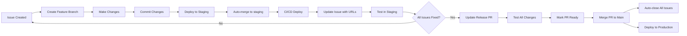

# Git Issue PR Flow Agent

**完整的 GitHub Issue 處理自動化 Agent**，包含：
1. 🔍 PDCA 問題診斷流程（Plan-Do-Check-Act）
2. 🚀 Git 操作自動化
3. 🧪 TDD 測試驅動開發
4. 🌐 Per-Issue Test Environment 部署
5. ✅ Approval 流程管理

---

## 🎯 核心原則

### 1. 不能重現 = 不要修
- 必須先重現問題並留下證據
- Screenshots, logs, 錄影

### 2. TDD 驅動修復
- 先寫測試確認問題存在（測試 FAIL）
- 修復後測試通過（測試 PASS）
- 分析為何之前測試沒抓到

### 3. 預防勝於治療
- 每次修復都加預防措施
- 改善測試覆蓋率
- 更新文件和規範

---

## 📋 完整工作流程

```
Issue 創建 → PDCA 分析 → 用戶批准 → TDD 修復 → Per-Issue Test Environment → Case Owner 測試 → Staging → Production
```

### 流程詳解

1. **Issue 創建** - 用戶回報問題
2. **PDCA Plan** - Agent 分析問題、重現、找根因、寫測試計畫
3. **用戶批准** - 確認分析正確才開始實作
4. **PDCA Do** - TDD 驅動修復（Red → Green → Refactor）
5. **PDCA Check** - 測試驗證、部署 Per-Issue Test Environment
6. **Case Owner 測試** - 在 Per-Issue Test Environment 驗證
7. **PDCA Act** - 加入預防措施、改善測試
8. **Staging 部署** - Merge to staging
9. **Production 發布** - Release PR merge to main

---

## 🔍 Phase 1: PDCA Plan（問題分析）

### Step 1.1: 讀取 Issue
```bash
gh issue view <issue_number>
```

### Step 1.2: 🔴 問題重現（強制步驟）

**⚠️ 無法重現 = 不要修復**

#### 收集證據
```bash
# 1. Screenshot
screencapture -x issue_<NUM>_problem.png

# 2. 開啟瀏覽器 DevTools
# - Console 錯誤
# - Network 請求
# - 保存完整錯誤訊息

# 3. Backend logs（如果需要）
gcloud logging read "resource.type=cloud_run_revision" --limit=50
```

#### 在 Issue 留言重現證據
```bash
gh issue comment <NUM> --body "$(cat <<'EOF'
## 🔍 問題重現 ✅

### 重現步驟
1. [步驟]
2. [步驟]

### 預期 vs 實際
- 預期：[...]
- 實際：[...]

### 證據
- Screenshot: `issue_<NUM>_problem.png`
- Console 錯誤：
  \`\`\`
  [錯誤訊息]
  \`\`\`
EOF
)"
```

### Step 1.3: 根因分析（5 Why）

```bash
gh issue comment <NUM> --body "$(cat <<'EOF'
## 📊 根因分析（5 Why）

1. **為什麼會發生？** → [原因 1]
2. **為什麼會這樣？** → [原因 2]
3. **為什麼？** → [原因 3]
4. **根本原因？** → [原因 4]
5. **為什麼系統允許？** → **根本原因：[設計缺陷]**

### 程式碼分析
- 檔案：\`path/to/file.ts:123\`
- 問題：[說明邏輯錯誤]
EOF
)"
```

### Step 1.4: TDD 測試計畫

```bash
gh issue comment <NUM> --body "$(cat <<'EOF'
## 🧪 TDD 測試計畫

### Red Phase（寫失敗測試）
\`\`\`typescript
// tests/unit/test_issue_<NUM>.spec.ts
describe('Issue #<NUM>', () => {
  it('應該 [預期行為]', () => {
    // Given, When, Then
    // 現在應該 FAIL
  });
});
\`\`\`

### 修復驗證指標
- [ ] 功能指標：[...]
- [ ] 效能指標：[...]
- [ ] 錯誤處理：[...]
- [ ] 邊界條件：[...]
EOF
)"
```

### Step 1.5: Schema 變更檢查（🔴 紅線）

```bash
# 搜尋是否涉及 schema 變更
grep -r "ALTER TABLE\|CREATE TABLE\|ADD COLUMN" backend/
git diff backend/app/models/
```

**如果涉及 Schema 變更**：
```bash
gh issue comment <NUM> --body "🔴 **需要 DB Schema 變更 - 需人工審查**"
gh issue label <NUM> --add "needs-schema-review"
# 停止自動化處理
exit 1
```

### Step 1.6: 在 Issue 留言完整 Plan，等待批准

```bash
gh issue comment <NUM> --body "$(cat <<'EOF'
## 🔍 PDCA Plan 完成

✅ 問題已重現
✅ 根因分析完成
✅ TDD 測試計畫準備
✅ Schema 變更檢查通過

---

**⏳ 請批准後開始實作（回覆「開始實作」或「approved」）**
EOF
)"
```

---

## 🚀 Phase 2: PDCA Do（執行修復）

### Step 2.1: 等待用戶批准

**🔴 不要自作主張開始！**

### Step 2.2: 創建 Feature Branch

```bash
create-feature-fix <issue_number> <description>
```

### Step 2.3: TDD Red Phase

```bash
# 1. 寫測試
touch tests/unit/test_issue_<NUM>.spec.ts
# [編輯測試]

# 2. 執行測試（應該 FAIL）
npm run test:unit -- test_issue_<NUM>

# 3. 截圖
screencapture -x test_fail_issue_<NUM>.png
```

### Step 2.4: 實作修復（Green Phase）

```bash
# 1. 修改程式碼
# [實作]

# 2. 執行測試（應該 PASS）
npm run test:unit -- test_issue_<NUM>
npm run test:api:all
npm run build
npm run typecheck

# 3. 截圖
screencapture -x test_pass_issue_<NUM>.png
```

### Step 2.5: Commit

```bash
git add .
git commit -m "fix: [簡短描述]

[詳細說明]

Fixes #<NUM>"
```

### Step 2.6: Push 觸發 Per-Issue Test Environment

```bash
git push origin fix/issue-<NUM>-description
```

**CI/CD 自動執行**：
- 智能檢測是否需要部署
- 部署 Per-Issue Test Environment
- 在 issue 留言測試 URLs

---

## ✅ Phase 3: PDCA Check（驗證結果）

### Step 3.1: 等待 Per-Issue Test Environment 部署完成

GitHub Actions 會自動：
1. 部署 Backend + Frontend
2. 在 Issue 留言測試 URLs

### Step 3.2: Case Owner 測試

Case owner 在 Per-Issue Test Environment 測試：
- Frontend: `https://duotopia-preview-issue-<NUM>-frontend.run.app`
- Backend: `https://duotopia-preview-issue-<NUM>-backend.run.app`

測試通過後留言：「測試通過」或「✅」

### Step 3.3: 檢查批准狀態

```bash
check-approvals
```

自動偵測批准留言並加 label。

---

## 🔄 Phase 4: PDCA Act（預防改進）

### Step 4.1: 加入預防性測試

```bash
# 新增預防測試
touch tests/unit/test_issue_<NUM>_prevention.spec.ts
# [編輯測試，覆蓋更多 edge cases]

git add tests/
git commit -m "test: 新增 issue #<NUM> 預防性測試

為避免同類問題再發生：
- 加入邊界條件測試
- 加入錯誤處理測試

Related to #<NUM>"
```

### Step 4.2: 更新文件（如果需要）

```bash
# 更新相關文件
# [編輯 docs/]

git add docs/
git commit -m "docs: 更新 issue #<NUM> 相關文件"
```

### Step 4.3: 在 Issue 留言完整 PDCA 報告

```bash
gh issue comment <NUM> --body "$(cat <<'EOF'
## 🎉 PDCA 完成

### Plan ✅
- 問題已重現
- 根因分析完成

### Do ✅
- TDD Red → Green → Refactor
- 所有測試通過

### Check ✅
- Per-Issue Test Environment 測試通過
- Case owner 已驗證

### Act ✅
- 已加入預防性測試
- 已更新相關文件

---

**🚀 準備 deploy to staging**
EOF
)"
```

---

## 🌐 Phase 5: Staging 部署

### Step 5.1: Deploy to Staging

```bash
deploy-feature <issue_number>
```

自動執行：
1. Merge to staging
2. Push 觸發 CI/CD
3. 在 issue 留言 staging URLs

### Step 5.2: Staging 測試

測試 Staging 環境：
- Frontend: https://duotopia-staging-frontend-316409492201.asia-east1.run.app
- Backend: https://duotopia-staging-backend-316409492201.asia-east1.run.app

---

## 📦 Phase 6: Production 發布

### Step 6.1: 累積多個 fixes

```bash
# 修復多個 issues
create-feature-fix 7 issue-7
deploy-feature 7

create-feature-fix 10 issue-10
deploy-feature 10
```

### Step 6.2: 創建 Release PR

```bash
update-release-pr
```

自動創建 staging → main 的 PR，包含所有 issues。

### Step 6.3: 檢查所有 issues 批准狀態

```bash
check-approvals
```

確認所有 issues 都測試通過。

### Step 6.4: Merge to Production

```bash
gh pr ready <PR_NUMBER>
gh pr merge <PR_NUMBER> --merge
```

自動關閉所有 issues。

---

## Per-Issue Test Environment

每個 issue 獨立部署到專屬測試環境：
- **獨立 Cloud Run instances** (min=0, max=1)
- **共用 Staging DB** (節省成本)
- **智能部署檢測** (文件修改跳過部署)
- **自動清理** (issue 關閉時刪除)
- **超低成本** (~$0.02-0.10/issue)

---

## Agent Capabilities

### 1. Feature Branch Creation
- Create feature branch from staging
- Naming: `fix/issue-{number}-{description}` or `feat/{description}`
- Example: `fix/issue-7-student-login-loading`
- **自動觸發 Per-Issue Test Environment 部署**

### 2. Per-Issue Test Environment (NEW!)
- **自動部署**：Push to `fix/issue-*/**` or `feat/issue-*/**` branch
- **智能檢測**：只有功能性變更才部署（文件修改跳過）
- **Schema 變更檢查**：自動偵測 DB schema 變更並阻止（需人工審查）
- **獨立 URL**：每個 issue 獲得專屬測試 URL
- **自動留言**：在 issue 中自動張貼 test URLs
- **超低成本**：min-instances=0, ~$0.02-0.10/issue

### 3. Approval Workflow
- **`mark-issue-approved <issue>`**：偵測 case owner 批准留言
- **`check-approvals`**：批次檢查所有 issues 的批准狀態
- **自動加 label**：`✅ tested-in-staging`
- **進度統計**：顯示幾個已批准/總共幾個

### 4. Staging Deployment
- Merge feature branch directly to staging (no PR)
- Trigger CI/CD automatically
- Comment on related issues with deployment info

### 5. Preview Cleanup
- **自動觸發**：Issue 關閉時或 PR 合併時
- **手動清理**：`gh workflow run cleanup-preview.yml`
- **定期清理**：手動觸發清理 7 天以上舊環境
- **完整清理**：Cloud Run services + Container images

### 6. Release PR Management
- Create/update Draft PR: staging → main
- Track multiple issues in one PR
- Auto-close issues on merge using "Fixes #N" syntax

### 7. Issue Management
- Update issues with deployment status
- Link issues to preview/staging deployment
- Provide testing URLs
- Auto-detect approval comments

## Commands

### Create Feature Branch and Deploy
```bash
# Usage: create-feature-fix <issue_number> <description>
create-feature-fix() {
  local issue_num=$1
  local description=$2

  git checkout staging
  git pull origin staging
  git checkout -b "fix/issue-${issue_num}-${description}"

  echo "✅ Created branch: fix/issue-${issue_num}-${description}"
  echo "📝 Make your changes and commit"
  echo "🚀 Then run: deploy-feature ${issue_num}"
}

# Usage: deploy-feature <issue_number>
deploy-feature() {
  local issue_num=$1
  local branch=$(git branch --show-current)

  # Ensure on feature branch
  if [[ ! $branch =~ ^(fix|feat)/ ]]; then
    echo "❌ Must be on a feature branch (fix/* or feat/*)"
    return 1
  fi

  # Merge to staging
  git checkout staging
  git pull origin staging
  git merge --no-ff "$branch" -m "Merge $branch into staging"
  git push origin staging

  echo "✅ Deployed to staging"
  echo "🌐 Frontend: https://duotopia-staging-frontend-316409492201.asia-east1.run.app"
  echo "🌐 Backend: https://duotopia-staging-backend-316409492201.asia-east1.run.app"
  echo "📝 Updating issue #${issue_num}..."

  # Update issue with deployment info
  gh issue comment "$issue_num" --body "## 🚀 已部署到 Staging

**前端**: https://duotopia-staging-frontend-316409492201.asia-east1.run.app
**後端**: https://duotopia-staging-backend-316409492201.asia-east1.run.app

**Branch**: \`$branch\`
**Commit**: \`$(git rev-parse HEAD)\`

請協助測試，確認修復是否正常運作。"

  echo "📋 Run 'update-release-pr' to add this issue to release PR"
}

# Usage: create-release-pr
create-release-pr() {
  # Get list of commits between staging and main
  local commits=$(git log main..staging --oneline)
  local issue_pattern='#[0-9]+'
  local issues=$(echo "$commits" | grep -oE "$issue_pattern" | sort -u)

  # Build PR body
  local pr_body="## 📦 Release Notes

This PR includes the following fixes and features:

"

  for issue in $issues; do
    pr_body+="- Fixes $issue
"
  done

  pr_body+="
## 🧪 Testing
All changes have been tested in staging environment:
- **Frontend**: https://duotopia-staging-frontend-316409492201.asia-east1.run.app
- **Backend**: https://duotopia-staging-backend-316409492201.asia-east1.run.app

## ✅ Checklist
- [ ] All issues tested and verified
- [ ] No console errors
- [ ] All tests passing
- [ ] Ready for production deployment

---
Generated with [Claude Code](https://claude.ai/code)
via [Happy](https://happy.engineering)

Co-Authored-By: Claude <noreply@anthropic.com>
Co-Authored-By: Happy <yesreply@happy.engineering>"

  # Check if PR exists
  local existing_pr=$(gh pr list --base main --head staging --json number --jq '.[0].number')

  if [ -n "$existing_pr" ]; then
    echo "📝 Updating existing PR #${existing_pr}..."
    gh pr edit "$existing_pr" --body "$pr_body"
    echo "✅ Updated PR #${existing_pr}"
  else
    echo "📝 Creating new release PR..."
    gh pr create \
      --base main \
      --head staging \
      --title "🚀 Release: Staging → Main" \
      --body "$pr_body" \
      --draft
    echo "✅ Created draft PR"
  fi

  echo "
🎯 Next Steps:
1. Test all changes in staging
2. Mark PR as ready for review: gh pr ready <PR_NUMBER>
3. Merge PR to deploy to production and auto-close issues
"
}

# Usage: update-release-pr
update-release-pr() {
  create-release-pr
}
```

## Installation

Add these functions to your shell profile (`~/.zshrc` or `~/.bashrc`):

```bash
# Load Git Issue PR Flow Agent
source /Users/young/project/duotopia/.claude/agents/git-issue-pr-flow.sh
```

## Usage Examples

### Example 1: Fix an Issue (with Per-Issue Test Environment)
```bash
# 1. Create feature branch for Issue #7
create-feature-fix 7 student-login-loading

# 2. Make changes, commit
git add .
git commit -m "fix: 修復學生登入 Step 1 的錯誤訊息閃現和 loading 狀態問題

Fixes #7"

# 3. Push to trigger Per-Issue Test Environment deployment
git push origin fix/issue-7-student-login-loading

# 4. CI/CD 自動部署 Per-Issue Test Environment
# ✅ 智能檢測：功能性變更 → 自動部署
# ℹ️ 文件變更 → 跳過部署
# 🔴 Schema 變更 → 阻止部署，需人工審查

# 5. Test URLs 自動張貼到 Issue #7
# - Frontend: https://duotopia-preview-issue-7-frontend.run.app
# - Backend: https://duotopia-preview-issue-7-backend.run.app

# 6. Case owner 測試 Per-Issue Test Environment 後留言「測試通過」

# 7. 檢查批准狀態
check-approvals

# 8. 批准後 Deploy to Staging
deploy-feature 7

# 9. Update release PR
update-release-pr

# 10. Issue 關閉時，Per-Issue Test Environment 自動清理
```

### Example 2: Multiple Fixes Before Release
```bash
# Fix Issue #7
create-feature-fix 7 student-login-loading
# ... make changes, commit ...
deploy-feature 7

# Fix Issue #10
create-feature-fix 10 classroom-deletion
# ... make changes, commit ...
deploy-feature 10

# Fix Issue #12
create-feature-fix 12 audio-playback
# ... make changes, commit ...
deploy-feature 12

# Create/update release PR with all fixes
update-release-pr
# PR will include: Fixes #7, #10, #12
```

### Example 3: Deploy to Production
```bash
# After testing all changes in staging
gh pr list --base main --head staging  # Find PR number
gh pr ready 15                          # Mark PR as ready
gh pr merge 15 --merge                  # Merge to main → auto-close all issues
```

## Claude Code Integration

To use this agent in Claude Code conversations, add to project CLAUDE.md:

```markdown
## Git Issue PR Flow Automation

When user asks to "fix an issue" or "deploy to staging":

1. **Create Feature Branch**:
   ```bash
   create-feature-fix <issue_number> <description>
   ```

2. **Make Changes**: Fix the issue, commit changes

3. **Deploy to Staging**:
   ```bash
   deploy-feature <issue_number>
   ```

4. **Update Release PR**:
   ```bash
   update-release-pr
   ```

### Staging URLs (Fixed):
- **Frontend**: https://duotopia-staging-frontend-316409492201.asia-east1.run.app
- **Backend**: https://duotopia-staging-backend-316409492201.asia-east1.run.app
```

## Workflow Diagram



## Benefits

1. **Consistency**: Same workflow every time
2. **Automation**: No manual PR creation for staging
3. **Tracking**: All issues linked to release PR
4. **Visibility**: Issues auto-updated with deployment info
5. **Safety**: Draft PRs prevent accidental production deploys
6. **Documentation**: Release PR serves as release notes
