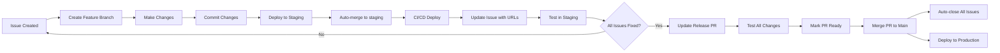

# Git Issue PR Flow Agent

**完整的 GitHub Issue 處理自動化 Agent**，包含：
1. 🔍 PDCA 問題診斷流程（Plan-Do-Check-Act）
2. 🚀 Git 操作自動化
3. 🧪 TDD 測試驅動開發
4. 🌐 Per-Issue Test Environment 部署
5. ✅ Approval 流程管理

---

## 🎯 核心原則

### 1. 不能重現 = 不要修
- 必須先重現問題並留下證據
- Screenshots, logs, 錄影

### 2. TDD 驅動修復
- 先寫測試確認問題存在（測試 FAIL）
- 修復後測試通過（測試 PASS）
- 分析為何之前測試沒抓到

### 3. 預防勝於治療
- 每次修復都加預防措施
- 改善測試覆蓋率
- 更新文件和規範

### 4. ⚠️ 避免意外關閉 Issue
- **Feature branch commit**: 使用 `Related to #N`，**不要用** `Fixes #N`
- **Feature branch PR**: 使用 `Related to #N`，**不要用** `Fixes #N`
- **Release PR (staging → main)**: **只有這裡**才使用 `Fixes #N`
- **原因**: GitHub 會在 commit push to main 時自動關閉 issue，跳過測試流程

---

## 📋 完整工作流程

```
Issue 創建 → PDCA 分析 → 用戶批准 → TDD 修復 → Per-Issue Test Environment → Case Owner 測試 → Staging → Production
```

### 流程詳解

1. **Issue 創建** - 案主回報問題（使用 GitHub Issue Template）
2. **創建 Feature Branch** - `create-feature-fix <NUM> <description>`
3. **TDD 開發** - Red → Green → Refactor
4. **創建 PR (feature → staging)** - 完整工程研發測試報告
5. **Push Feature Branch** - 觸發 Per-Issue Test Environment + CI/CD
6. **Per-Issue Test Environment** - 自動部署，在 Issue 留言測試 URLs
7. **CI/CD 檢查** - PR 中自動跑測試（Unit/Integration/E2E）
8. **工程師 Code Review** - 在 PR 中技術討論
9. **在 Issue 提供測試指引** - 給案主測試（業務語言）
10. **案主測試** - 在 Per-Issue Test Environment 驗證
11. **雙重批准** - ✅ 系統通過（CI/CD）+ ✅ 業務通過（案主）
12. **Merge PR to Staging** - `gh pr merge <PR_NUM>`
13. **在 Issue 通知案主** - 已部署到 staging
14. **Production 發布** - Release PR (staging → main)

**⚠️ 重要：每個 Issue 都需要 PR**
- ✅ **Feature branch PR (feature → staging)** - 完整工程報告 + CI/CD
- ✅ **Release PR (staging → main)** - 彙整多個 issues 到 production
- 💡 **為什麼需要兩種 PR？**
  - Feature PR：技術驗證（Code review + 自動化測試）
  - Release PR：業務發布（Production deployment）

---

## 🚨 處理 Issue 的強制規則

### 📌 適用範圍
**只針對處理 GitHub Issue 時才強制走自動化流程**

**其他情況可彈性處理**（緊急 hotfix、實驗功能、文件更新等）

### ❌ 處理 Issue 時禁止
```bash
# ❌ 跳過自動化流程！沒有 Per-Issue Test Environment
source git-issue-pr-flow.sh && deploy-feature X
git merge fix/issue-X into staging
git push origin staging  # 直接 push staging
```

### ✅ 處理 Issue 的正確流程
```bash
# 1. 創建 feature branch
create-feature-fix X description

# 2. TDD 開發（Red → Green → Refactor）
# ... 寫測試、修復、重構 ...

# 3. Commit
git add .
git commit -m "fix: xxx (Related to #X)"

# 4. Push 觸發 Per-Issue Test Environment
git push origin fix/issue-X-xxx
# → CI/CD 自動部署 Per-Issue Test Environment

# 5. 創建 PR (feature → staging) - 完整工程報告
gh pr create --base staging --head fix/issue-X-xxx \
  --title "Fix: [問題描述]" \
  --body "$(cat <<'EOF'
## 🎯 Purpose
修復 [簡短描述]

Related to #X

## 🔍 Problem Analysis
[使用 PR Template 填寫完整技術分析]
...
EOF
)"

# 6. CI/CD 自動在 PR 中跑測試
# → Unit tests, Integration tests, E2E tests, TypeScript, ESLint

# 7. 在 Issue 提供測試指引（給案主）
gh issue comment X --body "🧪 測試指引
測試環境: https://duotopia-preview-issue-X-frontend.run.app
...
（使用業務語言，案主看得懂）"

# 8. 案主在 Per-Issue Test Environment 測試並留言「測試通過」

# 9. 檢查批准狀態（AI 偵測）
check-approvals  # → 自動加 ✅ tested-in-staging label

# 10. 雙重批准確認
# ✅ 系統通過：PR 中 CI/CD 全部綠燈
# ✅ 業務通過：Issue 中案主批准

# 11. Merge PR to staging
gh pr merge <PR_NUM> --squash

# 12. 在 Issue 通知案主已部署到 staging
gh issue comment X --body "✅ 已部署到 Staging
測試 URL: https://duotopia-staging-frontend-..."
```

**⚠️ 重點**：
- ✅ **必須創建** feature → staging 的 PR（技術驗證）
- ✅ **PR = 完整工程報告**（根因分析、測試、CI/CD）
- ✅ **Issue = 案主溝通**（測試連結、批准）
- ✅ **雙重批准**：系統通過 + 業務通過

### 為什麼針對 Issue？
1. **Per-Issue Test Environment** - 案主獨立環境測試
2. **完整 PDCA 紀錄** - 所有決策在 GitHub 可追溯
3. **案主批准流程** - 確保修復符合預期
4. **CI/CD 自動化** - PR 觸發測試和部署

---

## 📝 Issue vs PR 的職責分工（重要）

### 核心原則：業務追蹤 vs 技術追蹤

**Issue 和 PR 各司其職，不重複**

| 維度 | **Issue（業務層）** | **PR（技術層）** |
|------|-------------------|-----------------|
| **受眾** | 👔 案主（非技術人員） | 💻 工程師（技術人員） |
| **目的** | 追蹤業務價值交付 | 追蹤技術實作品質 |
| **內容** | 問題描述、測試連結、批准 | 完整工程研發測試報告 |
| **語言** | 業務語言（案主看得懂） | 技術語言（根因分析、code diff） |
| **通過標準** | ✅ **業務通過**（案主測試 OK） | ✅ **系統通過**（CI/CD + Tests） |
| **Template** | GitHub Issue Template | GitHub PR Template |

### Issue 的內容（給案主看）

**✅ 應該包含**：
- 問題描述（業務語言）
- Per-Issue Test Environment 測試連結
- Staging 測試連結
- 案主測試結果和批准
- 最終結果通知

**❌ 不應該包含**：
- 技術根因分析（案主不需要知道）
- 程式碼 diff 討論
- 測試腳本執行結果
- CI/CD 技術細節

### PR 的內容（給工程師看）

**✅ 應該包含**：
- 完整的工程研發測試報告
- 根因分析（5 Why）
- 技術決策說明
- 測試覆蓋率（Unit/Integration/E2E）
- CI/CD 狀態檢查
- Code review 討論
- 影響範圍評估
- 預防措施（測試、文件）

**❌ 不應該包含**：
- 案主測試批准（這在 Issue 中）
- 業務描述（這在 Issue 中）

### PR 的價值

**為什麼需要 PR？**
1. 💻 **Code Review 平台** - 逐行評論、建議修改
2. 🤖 **CI/CD 檢查點** - Merge 前必須通過所有測試
3. 📝 **技術決策紀錄** - 為什麼這樣實作？
4. 🔒 **品質保證機制** - 防止壞代碼進入 staging/main
5. 📊 **完整工程報告** - 一個 feature/fix = 一個 PR

**Per-Issue Test Environment ≠ PR**：
- Per-Issue Test Environment：給**案主**測試功能（業務驗證）
- PR：給**工程師** code review 和自動化檢查（技術驗證）

### 案主和工程師的工作流程

| 角色 | 主要看哪裡 | 目的 |
|------|-----------|------|
| **案主** | 👀 Issue（95%）+ Staging URLs | 驗證功能是否符合需求 |
| **工程師** | 💻 PR（80%）+ Issue（20%） | Code review + 技術追蹤 |

---

## 🔍 Phase 1: PDCA Plan（問題分析）

### Step 1.1: 讀取 Issue
```bash
gh issue view <issue_number>
```

### Step 1.2: 🔴 問題重現（強制步驟）

**⚠️ 無法重現 = 不要修復**

#### 收集證據
```bash
# 1. Screenshot
screencapture -x issue_<NUM>_problem.png

# 2. 開啟瀏覽器 DevTools
# - Console 錯誤
# - Network 請求
# - 保存完整錯誤訊息

# 3. Backend logs（如果需要）
gcloud logging read "resource.type=cloud_run_revision" --limit=50
```

#### 🎯 範本：問題重現留言
```bash
gh issue comment <NUM> --body "$(cat <<'EOF'
## 🔍 問題重現 ✅

### 重現步驟
1. [具體步驟 1，例如：開啟學生登入頁面]
2. [具體步驟 2，例如：輸入帳號密碼並送出]
3. [具體步驟 3，例如：觀察錯誤訊息顯示]

### 預期 vs 實際
- **預期行為**：[例如：Step 1 不應該顯示錯誤訊息]
- **實際行為**：[例如：Step 1 閃現「帳號或密碼錯誤」訊息]
- **影響範圍**：[例如：所有學生登入流程]

### 證據
- **Screenshot**: `issue_<NUM>_problem.png`
- **Console 錯誤**：
  ```
  [完整錯誤訊息]
  ```
- **瀏覽器**：Chrome 120.0.6099.129
- **環境**：Staging / Production
- **URL**：[出問題的頁面 URL]

### 重現機率
- [x] 每次都能重現（100%）
- [ ] 偶爾發生（< 50%）
- [ ] 很難重現（< 10%）
EOF
)"
```

### Step 1.3: 根因分析（5 Why）

#### 🎯 範本：根因分析留言
```bash
gh issue comment <NUM> --body "$(cat <<'EOF'
## 📊 根因分析（5 Why）

### 5 Why 分析
1. **為什麼會發生？** → [例如：因為 errorMessage 狀態在 Step 1 就已經有值]
2. **為什麼會這樣？** → [例如：因為 loginStudent mutation 執行後設定了 errorMessage]
3. **為什麼？** → [例如：因為 Step 2 驗證失敗時設定了 errorMessage]
4. **為什麼不在 Step 2 才顯示？** → [例如：因為沒有檢查 currentStep === 2]
5. **為什麼系統允許？** → **根本原因：錯誤訊息顯示邏輯沒有考慮當前步驟狀態**

### 🔍 程式碼分析
**檔案位置**: `frontend/src/pages/StudentLogin.tsx:245-250`

**問題代碼**:
\`\`\`typescript
{errorMessage && (
  <Alert severity="error">{errorMessage}</Alert>
)}
\`\`\`

**根本問題**: 沒有檢查 `currentStep` 狀態，導致 Step 1 也會顯示 Step 2 的錯誤訊息

**正確邏輯應該是**:
\`\`\`typescript
{currentStep === 2 && errorMessage && (
  <Alert severity="error">{errorMessage}</Alert>
)}
\`\`\`

### 📈 影響範圍評估
- **受影響功能**: [例如：學生登入流程 Step 1-2]
- **受影響用戶**: [例如：所有學生用戶]
- **嚴重程度**: [🔴 Critical / 🟡 Medium / 🟢 Low]
- **資料風險**: [是/否，說明]
- **效能影響**: [是/否，說明]
EOF
)"
```

### Step 1.4: TDD 測試計畫

#### 🎯 範本：TDD 測試計畫留言
```bash
gh issue comment <NUM> --body "$(cat <<'EOF'
## 🧪 TDD 測試計畫

### 測試策略
**測試類型**: [Unit / Integration / E2E]
**測試檔案**: `tests/[unit|integration|e2e]/test_issue_<NUM>.spec.ts`

### Red Phase（寫失敗測試）
```typescript
// 例如：tests/e2e/test_issue_<NUM>_student_login.spec.ts
describe('Issue #<NUM>: 學生登入錯誤訊息顯示', () => {
  it('Step 1 不應該顯示錯誤訊息', async () => {
    // Given: 開啟學生登入頁面
    await page.goto('/student/login');

    // When: 輸入帳號密碼（但還在 Step 1）
    await page.fill('input[name="account"]', 'test_student');
    await page.fill('input[name="password"]', 'password123');

    // Then: 不應該看到錯誤訊息
    const errorAlert = await page.locator('div[role="alert"]');
    await expect(errorAlert).not.toBeVisible();

    // 目前這個測試應該 FAIL（因為 bug 存在）
  });

  it('Step 2 驗證失敗時才應該顯示錯誤', async () => {
    // Given: 進入 Step 2
    await submitStep1WithValidData();

    // When: Step 2 驗證失敗
    await triggerValidationError();

    // Then: 應該顯示錯誤訊息
    const errorAlert = await page.locator('div[role="alert"]');
    await expect(errorAlert).toBeVisible();
    await expect(errorAlert).toContainText('帳號或密碼錯誤');
  });
});
```

### 修復驗證指標（Definition of Done）
- [ ] **功能指標**: Step 1 不顯示錯誤訊息，Step 2 正確顯示
- [ ] **效能指標**: 無額外渲染，錯誤訊息只渲染一次
- [ ] **錯誤處理**: 各種錯誤情境都正確處理（網路錯誤、驗證錯誤等）
- [ ] **邊界條件**: 快速切換步驟時錯誤訊息不閃現
- [ ] **使用者體驗**: 錯誤訊息清晰易懂
- [ ] **相容性**: Chrome, Safari, Firefox 都正常運作

### Green Phase 目標
修復後所有測試應該 PASS：
- ✅ `test_issue_<NUM>.spec.ts` 全部通過
- ✅ 既有的 regression tests 不受影響
- ✅ TypeScript 編譯無錯誤
- ✅ ESLint 檢查通過
EOF
)"
```

### Step 1.5: Schema 變更檢查（🔴 紅線）

```bash
# 搜尋是否涉及 schema 變更
grep -r "ALTER TABLE\|CREATE TABLE\|ADD COLUMN" backend/
git diff backend/app/models/
```

**如果涉及 Schema 變更**：
```bash
gh issue comment <NUM> --body "🔴 **需要 DB Schema 變更 - 需人工審查**"
gh issue label <NUM> --add "needs-schema-review"
# 停止自動化處理
exit 1
```

### Step 1.6: 在 Issue 留言完整 Plan，等待批准

#### 🎯 範本：PDCA Plan 完成留言
```bash
gh issue comment <NUM> --body "$(cat <<'EOF'
## 🎯 PDCA Plan 完成

### ✅ Plan 階段檢查清單
- [x] **問題已重現** - 有截圖和錯誤訊息證據
- [x] **根因分析完成** - 5 Why 分析找到根本原因
- [x] **TDD 測試計畫準備** - Red → Green → Refactor 計畫完整
- [x] **Schema 變更檢查通過** - ✅ 不涉及 DB schema 變更
- [x] **影響範圍評估** - 了解受影響功能和用戶範圍
- [x] **風險評估** - 🟢 低風險 / 🟡 中風險 / 🔴 高風險

### 📋 修復摘要
**問題**: [一句話描述問題]
**根本原因**: [根因]
**修復方案**: [如何修復]
**預計工時**: [例如：2-4 小時]
**信心度**: [🟢 高信心 / 🟡 中信心 / 🔴 需要更多調查]

---

### ⏳ 等待批准

**不涉及 Schema 變更且有把握** → 可以直接開始實作
**涉及 Schema 變更或高風險** → 請批准後開始（回覆「開始實作」或「approved」）

準備好就開始 PDCA Do 階段！
EOF
)"
```

---

## 🚀 Phase 2: PDCA Do（執行修復）

### Step 2.1: 等待用戶批准

**🔴 不要自作主張開始！**

### Step 2.2: 創建 Feature Branch

```bash
create-feature-fix <issue_number> <description>
```

### Step 2.3: TDD Red Phase

```bash
# 1. 寫測試
touch tests/unit/test_issue_<NUM>.spec.ts
# [編輯測試]

# 2. 執行測試（應該 FAIL）
npm run test:unit -- test_issue_<NUM>

# 3. 截圖
screencapture -x test_fail_issue_<NUM>.png
```

### Step 2.4: 實作修復（Green Phase）

```bash
# 1. 修改程式碼
# [實作]

# 2. 執行測試（應該 PASS）
npm run test:unit -- test_issue_<NUM>
npm run test:api:all
npm run build
npm run typecheck

# 3. 截圖
screencapture -x test_pass_issue_<NUM>.png
```

### Step 2.5: Commit

```bash
git add .
# ⚠️ 重要：不要使用 "Fixes #N"！會在 push to main 時自動關閉 issue
git commit -m "fix: [簡短描述]

[詳細說明]

Related to #<NUM>"
```

### Step 2.6: Push 觸發 Per-Issue Test Environment

```bash
git push origin fix/issue-<NUM>-description
```

**CI/CD 自動執行**：
- 智能檢測是否需要部署
- 部署 Per-Issue Test Environment
- 在 issue 留言測試 URLs

---

## ✅ Phase 3: PDCA Check（驗證結果）

### Step 3.1: 等待 Per-Issue Test Environment 部署完成

GitHub Actions 會自動：
1. 部署 Backend + Frontend
2. 在 Issue 留言測試 URLs

### Step 3.2: 🔴 提供案主測試指引（強制步驟）

**⚠️ 必須提供清楚的測試步驟給案主**

#### 🎯 範本：測試指引留言（給案主）
```bash
gh issue comment <NUM> --body "$(cat <<'EOF'
## 🧪 測試指引（@case_owner_username 請協助測試）

### 🌐 測試環境
**Per-Issue Test Environment** (獨立測試環境，不影響 staging):
- **Frontend URL**: https://duotopia-preview-issue-<NUM>-frontend.run.app
- **Backend URL**: https://duotopia-preview-issue-<NUM>-backend.run.app
- **測試帳號**: [如需要，提供測試帳號和密碼]
- **資料庫**: Staging DB (共用，請小心操作)

⚠️ **注意**: Per-Issue Test Environment 會在測試完成後自動清理

---

### 📋 測試步驟（請按順序執行）

#### 步驟 1: 開啟學生登入頁面
1. 前往 https://duotopia-preview-issue-<NUM>-frontend.run.app/student/login
2. 確認頁面正常載入

#### 步驟 2: 測試 Step 1（輸入帳號密碼）
1. 輸入帳號: `test_student`
2. 輸入密碼: `password123`
3. **⚠️ 重點檢查**: 此時**不應該**看到任何錯誤訊息
4. 點擊「下一步」

#### 步驟 3: 測試 Step 2（驗證失敗情境）
1. 故意觸發驗證失敗（例如：[具體操作]）
2. **✅ 預期結果**: 現在**應該**看到「帳號或密碼錯誤」訊息
3. 檢查錯誤訊息是否清晰易懂

#### 步驟 4: 測試邊界條件
1. 快速在 Step 1 和 Step 2 之間切換
2. 確認錯誤訊息不會閃現
3. 重新整理頁面，確認狀態正確重置

---

### ✅ 預期結果 vs ❌ 不應該發生

| 情境 | ✅ 預期行為 | ❌ Bug 行為（修復前） |
|------|-----------|---------------------|
| **Step 1 輸入帳號密碼** | 不顯示錯誤訊息 | 閃現「帳號或密碼錯誤」❌ |
| **Step 2 驗證失敗** | 顯示錯誤訊息 | 正常顯示 ✅ |
| **快速切換步驟** | 錯誤訊息不閃現 | 錯誤訊息會閃現 ❌ |

---

### 🎯 測試通過標準

如果以下**所有條件**都符合，請留言「**測試通過**」或「**✅**」：
- [x] Step 1 不顯示錯誤訊息
- [x] Step 2 驗證失敗時正確顯示錯誤訊息
- [x] 快速切換步驟時無閃現
- [x] 錯誤訊息內容清晰易懂
- [x] 無 Console 錯誤
- [x] 整體使用體驗流暢

---

### ❌ 如果發現問題

請回報以下資訊：
1. **問題描述**: [發生什麼問題]
2. **重現步驟**: [如何觸發問題]
3. **截圖**: [最好附上截圖]
4. **Console 錯誤**: [如果有，請貼上]
5. **瀏覽器**: [Chrome / Safari / Firefox + 版本]

---

**感謝您的測試！** 🙏
EOF
)"
```

**🔴 沒有提供測試指引 = Check 階段不完整**

### Step 3.3: Case Owner 測試

Case owner 根據測試指引在 Per-Issue Test Environment 測試：
- Frontend: `https://duotopia-preview-issue-<NUM>-frontend.run.app`
- Backend: `https://duotopia-preview-issue-<NUM>-backend.run.app`

測試通過後留言：「測試通過」或「✅」

### Step 3.4: 檢查批准狀態

```bash
check-approvals
```

自動偵測批准留言並加 label。

---

## 🔄 Phase 4: PDCA Act（預防改進）

### Step 4.1: 加入預防性測試

```bash
# 新增預防測試
touch tests/unit/test_issue_<NUM>_prevention.spec.ts
# [編輯測試，覆蓋更多 edge cases]

git add tests/
git commit -m "test: 新增 issue #<NUM> 預防性測試

為避免同類問題再發生：
- 加入邊界條件測試
- 加入錯誤處理測試

Related to #<NUM>"
```

### Step 4.2: 更新文件（如果需要）

```bash
# 更新相關文件
# [編輯 docs/]

git add docs/
git commit -m "docs: 更新 issue #<NUM> 相關文件"
```

### Step 4.3: 在 Issue 留言完整 PDCA 報告

#### 🎯 範本：PDCA Act 完成留言
```bash
gh issue comment <NUM> --body "$(cat <<'EOF'
## 🛡️ PDCA Act - 預防改進完成

### 🧪 已加入預防性測試
**新增測試檔案**: `tests/unit/test_issue_<NUM>_prevention.spec.ts`

**預防測試覆蓋**:
- [x] 邊界條件測試（例如：快速切換步驟）
- [x] 錯誤處理測試（例如：網路錯誤、API 錯誤）
- [x] Regression 測試（確保未來不再發生）
- [x] 效能測試（如果相關）

**測試結果**: ✅ 全部通過

---

### 📚 文件更新（如果需要）
- [x] 更新元件使用文件（`docs/components/StudentLogin.md`）
- [x] 更新錯誤處理指南（`docs/ERROR_HANDLING.md`）
- [x] 更新程式碼註解（說明為何需要檢查 currentStep）

---

### 🎯 改善建議（長期）
1. **架構改善**: [例如：考慮使用狀態機管理多步驟表單]
2. **程式碼品質**: [例如：抽取可重用的錯誤處理 hook]
3. **測試覆蓋**: [例如：加入更多 E2E 測試]
4. **監控告警**: [例如：加入前端錯誤監控（Sentry）]

---

### 📊 完整 PDCA 摘要

| 階段 | 狀態 | 產出 |
|------|------|------|
| **Plan** ✅ | 完成 | 問題重現、根因分析、測試計畫 |
| **Do** ✅ | 完成 | TDD Red→Green→Refactor，所有測試通過 |
| **Check** ✅ | 完成 | Per-Issue Test Environment + Staging 測試通過 |
| **Act** ✅ | 完成 | 預防性測試、文件更新、改善建議 |

---

### 🚀 下一步

**已完成**:
- ✅ 修復問題（`frontend/src/pages/StudentLogin.tsx:245`）
- ✅ Per-Issue Test Environment 測試通過
- ✅ 所有測試通過（Unit + Integration + E2E）
- ✅ 預防性測試已加入
- ✅ 文件已更新

**準備 deploy to staging**:
```bash
deploy-feature <NUM>
```

**Issue 可以標記為**: `✅ tested-in-staging`（等待 case owner 批准後）

---

**本次修復 PDCA 完整報告到此結束** 🎉
EOF
)"
```

---

## 🌐 Phase 5: Staging 部署

### Step 5.1: Deploy to Staging

```bash
deploy-feature <issue_number>
```

自動執行：
1. Merge to staging
2. Push 觸發 CI/CD
3. 在 issue 留言 staging URLs

### Step 5.2: Staging 測試

測試 Staging 環境：
- Frontend: https://duotopia-staging-frontend-316409492201.asia-east1.run.app
- Backend: https://duotopia-staging-backend-316409492201.asia-east1.run.app

---

## 📦 Phase 6: Production 發布

### Step 6.1: 累積多個 fixes

```bash
# 修復多個 issues
create-feature-fix 7 issue-7
deploy-feature 7

create-feature-fix 10 issue-10
deploy-feature 10
```

### Step 6.2: 創建 Release PR

```bash
update-release-pr
```

自動創建 staging → main 的 PR，包含所有 issues。

### Step 6.3: 檢查所有 issues 批准狀態

```bash
check-approvals
```

確認所有 issues 都測試通過。

### Step 6.4: Merge to Production

```bash
gh pr ready <PR_NUMBER>
gh pr merge <PR_NUMBER> --merge
```

自動關閉所有 issues。

---

## Per-Issue Test Environment

每個 issue 獨立部署到專屬測試環境：
- **獨立 Cloud Run instances** (min=0, max=1)
- **共用 Staging DB** (節省成本)
- **智能部署檢測** (文件修改跳過部署)
- **自動清理** (issue 關閉時刪除)
- **超低成本** (~$0.02-0.10/issue)

---

## Agent Capabilities

### 1. Feature Branch Creation
- Create feature branch from staging
- Naming: `fix/issue-{number}-{description}` or `feat/{description}`
- Example: `fix/issue-7-student-login-loading`
- **自動觸發 Per-Issue Test Environment 部署**

### 2. Per-Issue Test Environment (NEW!)
- **自動部署**：Push to `fix/issue-*` or `feat/issue-*` branch（支援有無子目錄）
- **支援格式**：`fix/issue-15-desc` 或 `fix/issue-15/desc` 都可以
- **智能檢測**：只有功能性變更才部署（文件修改跳過）
- **Schema 變更檢查**：自動偵測 DB schema 變更並阻止（需人工審查）
- **獨立 URL**：每個 issue 獲得專屬測試 URL
- **自動留言**：在 issue 中自動張貼 test URLs
- **超低成本**：min-instances=0, ~$0.02-0.10/issue

### 3. Approval Workflow (🤖 AI-Powered)
- **`mark-issue-approved <issue>`**：🤖 **Claude Code 直接智能判斷** case owner 批准留言意圖
- **`check-approvals`**：批次檢查所有 issues 的批准狀態（Claude Code 自動 AI 偵測）
- **智能語義理解**：不依賴關鍵字，理解「看起來不錯」、「沒問題」、「可以了」等自然表達
- **自動降級**：在 Shell 環境直接執行時自動切換規則式偵測
- **自動加 label**：`✅ tested-in-staging`
- **進度統計**：顯示幾個已批准/總共幾個

#### AI 偵測架構
```
Claude Code 環境：
  ✅ 由 Claude Code 本身直接分析留言（不呼叫額外 API）
  ✅ 真正的語義理解
  ✅ 零成本、即時判斷

Shell 環境：
  ⚠️ 使用規則式關鍵字比對（fallback）
  ⚠️ 建議在 Claude Code 中執行以獲得最佳效果
```

### 4. Staging Deployment
- Merge feature branch directly to staging (no PR)
- Trigger CI/CD automatically
- Comment on related issues with deployment info

### 5. Preview Cleanup
- **自動觸發**：Issue 關閉時或 PR 合併時
- **手動清理**：`gh workflow run cleanup-preview.yml`
- **定期清理**：手動觸發清理 7 天以上舊環境
- **完整清理**：Cloud Run services + Container images

### 6. Release PR Management
- Create/update Draft PR: staging → main
- Track multiple issues in one PR
- **只在 Release PR 使用 "Fixes #N"**（staging → main）
- ⚠️ Feature branch PR 不要用 "Fixes #N"（會提前關閉 issue）

### 7. Issue Management
- Update issues with deployment status
- Link issues to preview/staging deployment
- Provide testing URLs
- Auto-detect approval comments

## Commands

### Create Feature Branch and Deploy
```bash
# Usage: create-feature-fix <issue_number> <description>
create-feature-fix() {
  local issue_num=$1
  local description=$2

  git checkout staging
  git pull origin staging
  git checkout -b "fix/issue-${issue_num}-${description}"

  echo "✅ Created branch: fix/issue-${issue_num}-${description}"
  echo "📝 Make your changes and commit"
  echo "🚀 Then run: deploy-feature ${issue_num}"
}

# Usage: deploy-feature <issue_number>
deploy-feature() {
  local issue_num=$1
  local branch=$(git branch --show-current)

  # Ensure on feature branch
  if [[ ! $branch =~ ^(fix|feat)/ ]]; then
    echo "❌ Must be on a feature branch (fix/* or feat/*)"
    return 1
  fi

  # Merge to staging
  git checkout staging
  git pull origin staging
  git merge --no-ff "$branch" -m "Merge $branch into staging"
  git push origin staging

  echo "✅ Deployed to staging"
  echo "🌐 Frontend: https://duotopia-staging-frontend-316409492201.asia-east1.run.app"
  echo "🌐 Backend: https://duotopia-staging-backend-316409492201.asia-east1.run.app"
  echo "📝 Updating issue #${issue_num}..."

  # Update issue with deployment info
  gh issue comment "$issue_num" --body "## 🚀 已部署到 Staging

**前端**: https://duotopia-staging-frontend-316409492201.asia-east1.run.app
**後端**: https://duotopia-staging-backend-316409492201.asia-east1.run.app

**Branch**: \`$branch\`
**Commit**: \`$(git rev-parse HEAD)\`

請協助測試，確認修復是否正常運作。"

  echo "📋 Run 'update-release-pr' to add this issue to release PR"
}

# Usage: create-release-pr
create-release-pr() {
  # Get list of commits between staging and main
  local commits=$(git log main..staging --oneline)
  local issue_pattern='#[0-9]+'
  local issues=$(echo "$commits" | grep -oE "$issue_pattern" | sort -u)

  # Build PR body
  local pr_body="## 📦 Release Notes

This PR includes the following fixes and features:

"

  for issue in $issues; do
    pr_body+="- Fixes $issue
"
  done

  pr_body+="
## 🧪 Testing
All changes have been tested in staging environment:
- **Frontend**: https://duotopia-staging-frontend-316409492201.asia-east1.run.app
- **Backend**: https://duotopia-staging-backend-316409492201.asia-east1.run.app

## ✅ Checklist
- [ ] All issues tested and verified
- [ ] No console errors
- [ ] All tests passing
- [ ] Ready for production deployment

---
Generated with [Claude Code](https://claude.ai/code)
via [Happy](https://happy.engineering)

Co-Authored-By: Claude <noreply@anthropic.com>
Co-Authored-By: Happy <yesreply@happy.engineering>"

  # Check if PR exists
  local existing_pr=$(gh pr list --base main --head staging --json number --jq '.[0].number')

  if [ -n "$existing_pr" ]; then
    echo "📝 Updating existing PR #${existing_pr}..."
    gh pr edit "$existing_pr" --body "$pr_body"
    echo "✅ Updated PR #${existing_pr}"
  else
    echo "📝 Creating new release PR..."
    gh pr create \
      --base main \
      --head staging \
      --title "🚀 Release: Staging → Main" \
      --body "$pr_body" \
      --draft
    echo "✅ Created draft PR"
  fi

  echo "
🎯 Next Steps:
1. Test all changes in staging
2. Mark PR as ready for review: gh pr ready <PR_NUMBER>
3. Merge PR to deploy to production and auto-close issues
"
}

# Usage: update-release-pr
update-release-pr() {
  create-release-pr
}
```

## Installation

Add these functions to your shell profile (`~/.zshrc` or `~/.bashrc`):

```bash
# Load Git Issue PR Flow Agent
source /Users/young/project/duotopia/.claude/agents/git-issue-pr-flow.sh
```

## Usage Examples

### Example 1: Fix an Issue (with Per-Issue Test Environment)
```bash
# 1. Create feature branch for Issue #7
create-feature-fix 7 student-login-loading

# 2. Make changes, commit
git add .
# ⚠️ 不要用 "Fixes #7"，會在 push to main 時自動關閉 issue
git commit -m "fix: 修復學生登入 Step 1 的錯誤訊息閃現和 loading 狀態問題

Related to #7"

# 3. Push to trigger Per-Issue Test Environment deployment
git push origin fix/issue-7-student-login-loading

# 4. CI/CD 自動部署 Per-Issue Test Environment
# ✅ 智能檢測：功能性變更 → 自動部署
# ℹ️ 文件變更 → 跳過部署
# 🔴 Schema 變更 → 阻止部署，需人工審查

# 5. Test URLs 自動張貼到 Issue #7
# - Frontend: https://duotopia-preview-issue-7-frontend.run.app
# - Backend: https://duotopia-preview-issue-7-backend.run.app

# 6. Case owner 測試 Per-Issue Test Environment 後留言「測試通過」

# 7. 檢查批准狀態
check-approvals

# 8. 批准後 Deploy to Staging
deploy-feature 7

# 9. Update release PR
update-release-pr

# 10. Issue 關閉時，Per-Issue Test Environment 自動清理
```

### Example 2: Multiple Fixes Before Release
```bash
# Fix Issue #7
create-feature-fix 7 student-login-loading
# ... make changes, commit ...
deploy-feature 7

# Fix Issue #10
create-feature-fix 10 classroom-deletion
# ... make changes, commit ...
deploy-feature 10

# Fix Issue #12
create-feature-fix 12 audio-playback
# ... make changes, commit ...
deploy-feature 12

# Create/update release PR with all fixes
update-release-pr
# ✅ Release PR (staging → main) 使用 "Fixes #N" 是正確的
# PR description 會包含: Fixes #7, #10, #12
```

### Example 3: Deploy to Production
```bash
# After testing all changes in staging
gh pr list --base main --head staging  # Find PR number
gh pr ready 15                          # Mark PR as ready
gh pr merge 15 --merge                  # Merge to main → auto-close all issues
```

## Claude Code Integration

To use this agent in Claude Code conversations, add to project CLAUDE.md:

```markdown
## Git Issue PR Flow Automation

When user asks to "fix an issue" or "deploy to staging":

1. **Create Feature Branch**:
   ```bash
   create-feature-fix <issue_number> <description>
   ```

2. **Make Changes**: Fix the issue, commit changes

3. **Deploy to Staging**:
   ```bash
   deploy-feature <issue_number>
   ```

4. **Update Release PR**:
   ```bash
   update-release-pr
   ```

### Staging URLs (Fixed):
- **Frontend**: https://duotopia-staging-frontend-316409492201.asia-east1.run.app
- **Backend**: https://duotopia-staging-backend-316409492201.asia-east1.run.app
```

## Workflow Diagram



## Benefits

1. **Consistency**: Same workflow every time
2. **Automation**: No manual PR creation for staging
3. **Tracking**: All issues linked to release PR
4. **Visibility**: Issues auto-updated with deployment info
5. **Safety**: Draft PRs prevent accidental production deploys
6. **Documentation**: Release PR serves as release notes
