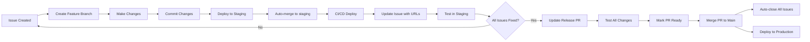

# Git Issue PR Flow Agent

This agent automates the standardized Git Issue PR Flow workflow for Duotopia project.

## Workflow Overview

```
Feature Branch → Per-Issue Test Environment (per-issue testing) → Staging (approved changes) → Main (PR with issue tracking)
```

### Per-Issue Test Environment

每個 issue 自動獲得獨立的測試環境：
- **獨立 Cloud Run instances** (min=0, max=1)
- **共用 Staging DB** (節省成本)
- **智能部署檢測** (文件修改跳過部署)
- **自動清理** (issue 關閉時刪除)
- **超低成本** (~$0.02-0.10/issue)

## Agent Capabilities

### 1. Feature Branch Creation
- Create feature branch from staging
- Naming: `fix/issue-{number}-{description}` or `feat/{description}`
- Example: `fix/issue-7-student-login-loading`
- **自動觸發 Per-Issue Test Environment 部署**

### 2. Per-Issue Test Environment (NEW!)
- **自動部署**：Push to `fix/issue-*/**` or `feat/issue-*/**` branch
- **智能檢測**：只有功能性變更才部署（文件修改跳過）
- **Schema 變更檢查**：自動偵測 DB schema 變更並阻止（需人工審查）
- **獨立 URL**：每個 issue 獲得專屬測試 URL
- **自動留言**：在 issue 中自動張貼 test URLs
- **超低成本**：min-instances=0, ~$0.02-0.10/issue

### 3. Approval Workflow
- **`mark-issue-approved <issue>`**：偵測 case owner 批准留言
- **`check-approvals`**：批次檢查所有 issues 的批准狀態
- **自動加 label**：`✅ tested-in-staging`
- **進度統計**：顯示幾個已批准/總共幾個

### 4. Staging Deployment
- Merge feature branch directly to staging (no PR)
- Trigger CI/CD automatically
- Comment on related issues with deployment info

### 5. Preview Cleanup
- **自動觸發**：Issue 關閉時或 PR 合併時
- **手動清理**：`gh workflow run cleanup-preview.yml`
- **定期清理**：手動觸發清理 7 天以上舊環境
- **完整清理**：Cloud Run services + Container images

### 6. Release PR Management
- Create/update Draft PR: staging → main
- Track multiple issues in one PR
- Auto-close issues on merge using "Fixes #N" syntax

### 7. Issue Management
- Update issues with deployment status
- Link issues to preview/staging deployment
- Provide testing URLs
- Auto-detect approval comments

## Commands

### Create Feature Branch and Deploy
```bash
# Usage: create-feature-fix <issue_number> <description>
create-feature-fix() {
  local issue_num=$1
  local description=$2

  git checkout staging
  git pull origin staging
  git checkout -b "fix/issue-${issue_num}-${description}"

  echo "✅ Created branch: fix/issue-${issue_num}-${description}"
  echo "📝 Make your changes and commit"
  echo "🚀 Then run: deploy-feature ${issue_num}"
}

# Usage: deploy-feature <issue_number>
deploy-feature() {
  local issue_num=$1
  local branch=$(git branch --show-current)

  # Ensure on feature branch
  if [[ ! $branch =~ ^(fix|feat)/ ]]; then
    echo "❌ Must be on a feature branch (fix/* or feat/*)"
    return 1
  fi

  # Merge to staging
  git checkout staging
  git pull origin staging
  git merge --no-ff "$branch" -m "Merge $branch into staging"
  git push origin staging

  echo "✅ Deployed to staging"
  echo "🌐 Frontend: https://duotopia-staging-frontend-316409492201.asia-east1.run.app"
  echo "🌐 Backend: https://duotopia-staging-backend-316409492201.asia-east1.run.app"
  echo "📝 Updating issue #${issue_num}..."

  # Update issue with deployment info
  gh issue comment "$issue_num" --body "## 🚀 已部署到 Staging

**前端**: https://duotopia-staging-frontend-316409492201.asia-east1.run.app
**後端**: https://duotopia-staging-backend-316409492201.asia-east1.run.app

**Branch**: \`$branch\`
**Commit**: \`$(git rev-parse HEAD)\`

請協助測試，確認修復是否正常運作。"

  echo "📋 Run 'update-release-pr' to add this issue to release PR"
}

# Usage: create-release-pr
create-release-pr() {
  # Get list of commits between staging and main
  local commits=$(git log main..staging --oneline)
  local issue_pattern='#[0-9]+'
  local issues=$(echo "$commits" | grep -oE "$issue_pattern" | sort -u)

  # Build PR body
  local pr_body="## 📦 Release Notes

This PR includes the following fixes and features:

"

  for issue in $issues; do
    pr_body+="- Fixes $issue
"
  done

  pr_body+="
## 🧪 Testing
All changes have been tested in staging environment:
- **Frontend**: https://duotopia-staging-frontend-316409492201.asia-east1.run.app
- **Backend**: https://duotopia-staging-backend-316409492201.asia-east1.run.app

## ✅ Checklist
- [ ] All issues tested and verified
- [ ] No console errors
- [ ] All tests passing
- [ ] Ready for production deployment

---
Generated with [Claude Code](https://claude.ai/code)
via [Happy](https://happy.engineering)

Co-Authored-By: Claude <noreply@anthropic.com>
Co-Authored-By: Happy <yesreply@happy.engineering>"

  # Check if PR exists
  local existing_pr=$(gh pr list --base main --head staging --json number --jq '.[0].number')

  if [ -n "$existing_pr" ]; then
    echo "📝 Updating existing PR #${existing_pr}..."
    gh pr edit "$existing_pr" --body "$pr_body"
    echo "✅ Updated PR #${existing_pr}"
  else
    echo "📝 Creating new release PR..."
    gh pr create \
      --base main \
      --head staging \
      --title "🚀 Release: Staging → Main" \
      --body "$pr_body" \
      --draft
    echo "✅ Created draft PR"
  fi

  echo "
🎯 Next Steps:
1. Test all changes in staging
2. Mark PR as ready for review: gh pr ready <PR_NUMBER>
3. Merge PR to deploy to production and auto-close issues
"
}

# Usage: update-release-pr
update-release-pr() {
  create-release-pr
}
```

## Installation

Add these functions to your shell profile (`~/.zshrc` or `~/.bashrc`):

```bash
# Load Git Issue PR Flow Agent
source /Users/young/project/duotopia/.claude/agents/git-issue-pr-flow.sh
```

## Usage Examples

### Example 1: Fix an Issue (with Per-Issue Test Environment)
```bash
# 1. Create feature branch for Issue #7
create-feature-fix 7 student-login-loading

# 2. Make changes, commit
git add .
git commit -m "fix: 修復學生登入 Step 1 的錯誤訊息閃現和 loading 狀態問題

Fixes #7"

# 3. Push to trigger Per-Issue Test Environment deployment
git push origin fix/issue-7-student-login-loading

# 4. CI/CD 自動部署 Per-Issue Test Environment
# ✅ 智能檢測：功能性變更 → 自動部署
# ℹ️ 文件變更 → 跳過部署
# 🔴 Schema 變更 → 阻止部署，需人工審查

# 5. Test URLs 自動張貼到 Issue #7
# - Frontend: https://duotopia-preview-issue-7-frontend.run.app
# - Backend: https://duotopia-preview-issue-7-backend.run.app

# 6. Case owner 測試 Per-Issue Test Environment 後留言「測試通過」

# 7. 檢查批准狀態
check-approvals

# 8. 批准後 Deploy to Staging
deploy-feature 7

# 9. Update release PR
update-release-pr

# 10. Issue 關閉時，Per-Issue Test Environment 自動清理
```

### Example 2: Multiple Fixes Before Release
```bash
# Fix Issue #7
create-feature-fix 7 student-login-loading
# ... make changes, commit ...
deploy-feature 7

# Fix Issue #10
create-feature-fix 10 classroom-deletion
# ... make changes, commit ...
deploy-feature 10

# Fix Issue #12
create-feature-fix 12 audio-playback
# ... make changes, commit ...
deploy-feature 12

# Create/update release PR with all fixes
update-release-pr
# PR will include: Fixes #7, #10, #12
```

### Example 3: Deploy to Production
```bash
# After testing all changes in staging
gh pr list --base main --head staging  # Find PR number
gh pr ready 15                          # Mark PR as ready
gh pr merge 15 --merge                  # Merge to main → auto-close all issues
```

## Claude Code Integration

To use this agent in Claude Code conversations, add to project CLAUDE.md:

```markdown
## Git Issue PR Flow Automation

When user asks to "fix an issue" or "deploy to staging":

1. **Create Feature Branch**:
   ```bash
   create-feature-fix <issue_number> <description>
   ```

2. **Make Changes**: Fix the issue, commit changes

3. **Deploy to Staging**:
   ```bash
   deploy-feature <issue_number>
   ```

4. **Update Release PR**:
   ```bash
   update-release-pr
   ```

### Staging URLs (Fixed):
- **Frontend**: https://duotopia-staging-frontend-316409492201.asia-east1.run.app
- **Backend**: https://duotopia-staging-backend-316409492201.asia-east1.run.app
```

## Workflow Diagram



## Benefits

1. **Consistency**: Same workflow every time
2. **Automation**: No manual PR creation for staging
3. **Tracking**: All issues linked to release PR
4. **Visibility**: Issues auto-updated with deployment info
5. **Safety**: Draft PRs prevent accidental production deploys
6. **Documentation**: Release PR serves as release notes
