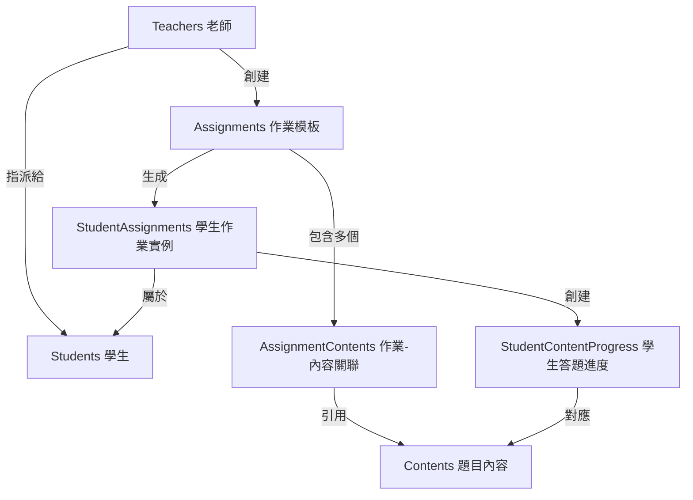

# 作業系統資料流程圖 - 從指派到完成

## 📊 資料庫結構關係



## 🔄 完整作業流程

### 1️⃣ **老師創建作業模板** (Assignment)

**動作**: POST /api/teachers/assignments
**建立資料**:
```sql
INSERT INTO assignments (
    title,           -- "0917-2"
    description,     -- "今日練習"
    teacher_id,      -- 33 (老師ID)
    classroom_id,    -- 5 (班級ID)
    due_date,        -- "2024-09-20"
    created_at
) VALUES (...);
-- 假設產生 assignment.id = 33
```

### 2️⃣ **關聯題目內容** (AssignmentContents)

**動作**: 老師選擇要包含的題目
**建立資料**:
```sql
-- 加入第一個題目
INSERT INTO assignment_contents (
    assignment_id,   -- 33
    content_id,      -- 23 (Be Verbs)
    order_index      -- 0
) VALUES (33, 23, 0);

-- 加入第二個題目
INSERT INTO assignment_contents (
    assignment_id,   -- 33
    content_id,      -- 24 (Articles)
    order_index      -- 1
) VALUES (33, 24, 1);
```

### 3️⃣ **指派給學生** (StudentAssignments)

**動作**: POST /api/teachers/assignments/{id}/assign
**建立資料**: 為每個學生創建一個 StudentAssignment
```sql
-- 為學生王小明創建
INSERT INTO student_assignments (
    student_id,      -- 1 (王小明)
    assignment_id,   -- 33 (作業模板)
    status,          -- 'NOT_STARTED'
    created_at
) VALUES (1, 33, 'NOT_STARTED', NOW());
-- 假設產生 student_assignment.id = 365
```

### 4️⃣ **自動創建進度記錄** (StudentContentProgress)

**動作**: 系統自動為每個題目創建進度記錄
**建立資料**:
```sql
-- 為第一題創建進度
INSERT INTO student_content_progress (
    student_assignment_id,  -- 365
    content_id,            -- 23 (Be Verbs)
    order_index,           -- 0
    status,                -- 'NOT_STARTED'
    response_data          -- NULL
) VALUES (365, 23, 0, 'NOT_STARTED', NULL);

-- 為第二題創建進度
INSERT INTO student_content_progress (
    student_assignment_id,  -- 365
    content_id,            -- 24 (Articles)
    order_index,           -- 1
    status,                -- 'NOT_STARTED'
    response_data          -- NULL
) VALUES (365, 24, 1, 'NOT_STARTED', NULL);
```

### 5️⃣ **學生開始作業**

**動作**: GET /api/students/assignments/{id}/activities
**更新資料**:
```sql
UPDATE student_assignments
SET status = 'IN_PROGRESS',
    started_at = NOW()
WHERE id = 365;
```

### 6️⃣ **學生答題（錄音）**

**動作**: POST /api/students/upload-recording
**更新資料**:
```sql
-- 更新第一題的第二個小題
UPDATE student_content_progress
SET response_data = JSON_SET(
    response_data,
    '$.recordings[1]', 'https://gcs.../audio123.webm',
    '$.answers[1]', 'You are happy',
    '$.recorded_at', '2024-09-17T10:30:00'
),
status = 'IN_PROGRESS'
WHERE student_assignment_id = 365
AND content_id = 23;
```

### 7️⃣ **AI 評分**

**動作**: 背景任務自動評分
**更新資料**:
```sql
UPDATE student_content_progress
SET response_data = JSON_SET(
    response_data,
    '$.ai_assessments[1]', JSON_OBJECT(
        'accuracy_score', 85.5,
        'fluency_score', 78.9,
        'pronunciation_score', 90.2
    )
)
WHERE student_assignment_id = 365
AND content_id = 23;
```

### 8️⃣ **學生提交作業**

**動作**: POST /api/students/assignments/{id}/submit
**更新資料**:
```sql
-- 更新學生作業狀態
UPDATE student_assignments
SET status = 'SUBMITTED',
    submitted_at = NOW()
WHERE id = 365;

-- 更新所有題目進度為已提交
UPDATE student_content_progress
SET status = 'SUBMITTED'
WHERE student_assignment_id = 365;
```

### 9️⃣ **老師批改** (選擇性)

**動作**: POST /api/teachers/assignments/{id}/grade
**更新資料**:
```sql
UPDATE student_assignments
SET status = 'GRADED',
    score = 85,
    feedback = '很棒！繼續加油',
    graded_at = NOW()
WHERE id = 365;
```

## 📋 重要資料表關係總結

### **Assignments** (作業模板)
- 老師創建的作業定義
- 包含標題、說明、截止日期
- 一對多關聯到 AssignmentContents

### **AssignmentContents** (作業-內容關聯)
- 定義作業包含哪些題目
- 指定題目順序 (order_index)
- 多對多關聯 Assignments 和 Contents

### **StudentAssignments** (學生作業實例)
- 每個學生的作業副本
- 追蹤狀態：NOT_STARTED → IN_PROGRESS → SUBMITTED → GRADED
- 記錄開始時間、提交時間、分數

### **StudentContentProgress** (學生答題進度)
- 每題的答題記錄
- response_data (JSONB) 儲存：
  - recordings: 錄音檔案陣列
  - answers: 答案陣列
  - ai_assessments: AI評分陣列
- 追蹤每題狀態

### **Contents** (題目內容)
- 實際的題目資料
- items: 題目陣列（可能多個小題）
- 屬於某個 Lesson

## 🔑 關鍵欄位說明

### response_data 結構範例：
```json
{
  "recordings": [
    "",  // 第一小題沒錄音
    "https://gcs.../audio123.webm"  // 第二小題的錄音
  ],
  "answers": [
    "",
    "You are happy"
  ],
  "ai_assessments": [
    null,  // 第一小題沒評分
    {
      "accuracy_score": 85.5,
      "fluency_score": 78.9,
      "pronunciation_score": 90.2
    }
  ]
}
```

## ⚠️ 之前的 BUG 問題

**問題**: upload-recording API 硬編碼 `content_id = 1`
**影響**: 創建錯誤的 StudentContentProgress 記錄
**修復**: 從現有記錄中查找正確的 content_id
