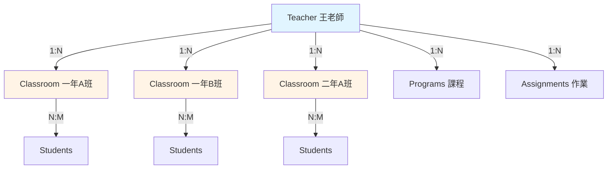
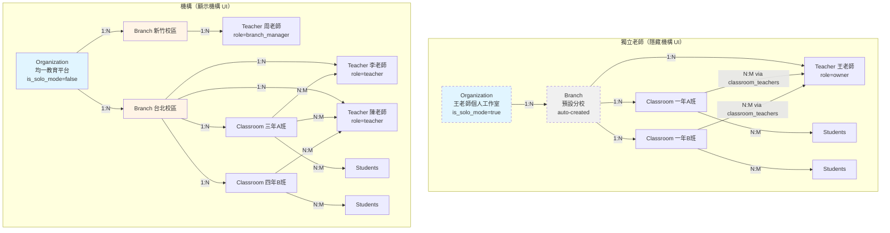

# 架構比較：現在 vs 統一機構架構

## 🎯 目標：最小化客製化邏輯

---

## 📊 現在的架構（獨立老師）



**資料表關係**：
```sql
teachers (id, email, name)
  └── classrooms (id, teacher_id, name)  -- 1:N，一個老師多個班級
       └── classroom_students (classroom_id, student_id)  -- N:M
            └── students (id, name, email)
```

**問題**：
- ❌ 班級只能有一個老師（`teacher_id` 是單值）
- ❌ 沒有「機構」「分校」概念
- ❌ 無法共管班級

---

## 🏢 未來統一架構（所有老師都是機構模式）

### 方案：所有老師都自動建立「個人機構」



---

## 📋 統一資料表結構

```sql
-- 機構（所有老師都有，獨立老師自動建立）
organizations (
    id UUID PRIMARY KEY,
    name VARCHAR(200),
    is_solo_mode BOOLEAN DEFAULT false,  -- 獨立老師 = true
    plan_type VARCHAR(20),                -- 'free', 'basic', 'premium', 'enterprise'
    created_at TIMESTAMP
)

-- 分校（所有老師都有，獨立老師自動建立「預設分校」）
branches (
    id UUID PRIMARY KEY,
    organization_id UUID REFERENCES organizations(id),
    name VARCHAR(200),
    is_default BOOLEAN DEFAULT false,     -- 獨立老師的預設分校 = true
    created_at TIMESTAMP
)

-- 老師（全部都關聯到 organization + branch）
teachers (
    id INTEGER PRIMARY KEY,
    organization_id UUID REFERENCES organizations(id) NOT NULL,  -- 不能為空
    branch_id UUID REFERENCES branches(id) NOT NULL,             -- 不能為空
    email VARCHAR(255),
    name VARCHAR(100),
    role VARCHAR(20) DEFAULT 'teacher',  -- 'teacher', 'branch_manager', 'org_admin'
    created_at TIMESTAMP
)

-- 班級（屬於分校，不直接屬於老師）
classrooms (
    id INTEGER PRIMARY KEY,
    branch_id UUID REFERENCES branches(id) NOT NULL,  -- 屬於分校
    name VARCHAR(100),
    created_by INTEGER REFERENCES teachers(id),       -- 建立者（保留舊 teacher_id）
    created_at TIMESTAMP
)

-- 班級-老師關聯表（多對多，支援共管）
classroom_teachers (
    classroom_id INTEGER REFERENCES classrooms(id),
    teacher_id INTEGER REFERENCES teachers(id),
    role VARCHAR(20) DEFAULT 'owner',        -- 'owner', 'co_teacher', 'assistant'
    can_edit BOOLEAN DEFAULT true,           -- 可編輯班級資訊
    can_assign BOOLEAN DEFAULT true,         -- 可指派作業
    can_grade BOOLEAN DEFAULT true,          -- 可批改作業
    joined_at TIMESTAMP,
    PRIMARY KEY (classroom_id, teacher_id)
)

-- 學生（保持不變）
students (
    id INTEGER PRIMARY KEY,
    organization_id UUID REFERENCES organizations(id),  -- 新增，可 NULL（舊學生）
    branch_id UUID REFERENCES branches(id),             -- 新增，可 NULL（舊學生）
    name VARCHAR(100),
    email VARCHAR(255),
    student_number VARCHAR(50),
    created_at TIMESTAMP
)

-- 班級-學生關聯（保持不變）
classroom_students (
    classroom_id INTEGER REFERENCES classrooms(id),
    student_id INTEGER REFERENCES students(id),
    PRIMARY KEY (classroom_id, student_id)
)
```

---

## 🔄 資料遷移策略（向下相容）

### Step 1: 為現有獨立老師自動建立機構

```sql
-- 為每個現有老師建立「個人機構」
INSERT INTO organizations (id, name, is_solo_mode, plan_type)
SELECT
    gen_random_uuid(),
    CONCAT(name, '個人工作室'),
    true,  -- 標記為獨立模式
    'free'
FROM teachers
WHERE organization_id IS NULL;

-- 為每個機構建立「預設分校」
INSERT INTO branches (id, organization_id, name, is_default)
SELECT
    gen_random_uuid(),
    o.id,
    '預設分校',
    true
FROM organizations o
WHERE o.is_solo_mode = true;

-- 更新老師關聯
UPDATE teachers t
SET
    organization_id = o.id,
    branch_id = b.id
FROM organizations o
JOIN branches b ON b.organization_id = o.id AND b.is_default = true
WHERE t.organization_id IS NULL
AND o.name = CONCAT(t.name, '個人工作室');
```

### Step 2: 遷移班級關聯

```sql
-- 1. 新增 branch_id 到 classrooms
ALTER TABLE classrooms ADD COLUMN branch_id UUID REFERENCES branches(id);

-- 2. 更新班級的 branch_id（從老師的 branch_id 繼承）
UPDATE classrooms c
SET branch_id = t.branch_id
FROM teachers t
WHERE c.teacher_id = t.id;

-- 3. 建立 classroom_teachers 關聯表
CREATE TABLE classroom_teachers (
    classroom_id INTEGER REFERENCES classrooms(id) ON DELETE CASCADE,
    teacher_id INTEGER REFERENCES teachers(id) ON DELETE CASCADE,
    role VARCHAR(20) DEFAULT 'owner',
    can_edit BOOLEAN DEFAULT true,
    can_assign BOOLEAN DEFAULT true,
    can_grade BOOLEAN DEFAULT true,
    joined_at TIMESTAMP DEFAULT NOW(),
    PRIMARY KEY (classroom_id, teacher_id)
);

-- 4. 遷移現有關係：teacher_id → classroom_teachers
INSERT INTO classroom_teachers (classroom_id, teacher_id, role, can_edit, can_assign, can_grade)
SELECT id, teacher_id, 'owner', true, true, true
FROM classrooms
WHERE teacher_id IS NOT NULL;

-- 5. 重新命名 teacher_id 為 created_by（保留建立者資訊）
ALTER TABLE classrooms RENAME COLUMN teacher_id TO created_by;
```

---

## 🎨 UI 差異：只用一個 Flag 控制

### TeacherLayout 邏輯

```typescript
interface TeacherContext {
  organization: Organization
  branch: Branch
  teacher: Teacher
  role: 'teacher' | 'branch_manager' | 'org_admin'
  is_solo_mode: boolean  // ← 唯一的客製化 flag
}

// Sidebar 邏輯（唯一的 if 判斷）
const getSidebarItems = (ctx: TeacherContext) => {
  const items = [
    { label: '首頁', path: '/teacher/dashboard' },
    { label: '班級', path: '/teacher/classrooms' },
    { label: '所有學生', path: '/teacher/students' },
    { label: '課程', path: '/teacher/courses' },
  ]

  // ✅ 唯一的客製化邏輯：獨立模式隱藏機構管理
  if (!ctx.is_solo_mode) {
    if (ctx.role === 'org_admin') {
      items.splice(1, 0,
        { label: '機構總覽', path: '/org/overview' },
        { label: '分校管理', path: '/org/branches' }
      )
    }
    if (ctx.role === 'branch_manager' || ctx.role === 'org_admin') {
      items.splice(1, 0, { label: '老師管理', path: '/org/teachers' })
    }
  }

  items.push({ label: '個人設定', path: '/teacher/profile' })
  return items
}
```

### TopBar 顯示（動態內容）

```typescript
// 獨立老師（is_solo_mode = true）
<TopBar>
  <Logo />
  <TeacherName>王老師</TeacherName>
  {/* 不顯示機構資訊 */}
</TopBar>

// 機構老師（is_solo_mode = false）
<TopBar>
  <Logo />
  <Breadcrumb>均一教育平台 / 台北校區</Breadcrumb>
  <TeacherName>李老師</TeacherName>
</TopBar>
```

---

## 📊 API 查詢邏輯（完全統一）

### 班級查詢（不需要區分獨立/機構）

```python
@router.get("/classrooms")
def get_classrooms(current_user: Teacher = Depends(get_current_user)):
    """
    ✅ 統一邏輯：查詢我有權限的所有班級
    - 獨立老師：查到自己的班級（透過 classroom_teachers）
    - 機構老師：查到自己的班級（透過 classroom_teachers）
    - 分校主管：查到分校內所有班級（透過 branch_id）
    - 機構管理員：查到機構內所有班級（透過 organization_id）
    """

    if current_user.role == 'org_admin':
        # 機構管理員：查該機構所有班級
        return db.query(Classroom).filter(
            Classroom.branch_id.in_(
                select(Branch.id).where(Branch.organization_id == current_user.organization_id)
            )
        ).all()

    elif current_user.role == 'branch_manager':
        # 分校主管：查該分校所有班級
        return db.query(Classroom).filter(
            Classroom.branch_id == current_user.branch_id
        ).all()

    else:
        # 一般老師（獨立或機構）：查我有權限的班級
        return db.query(Classroom).join(ClassroomTeacher).filter(
            ClassroomTeacher.teacher_id == current_user.id
        ).all()
```

**關鍵**：不需要 `if is_solo_mode` 判斷！邏輯完全統一！

---

## ✅ 客製化邏輯對比

### 現在（假設要支援機構）

```python
# ❌ 需要大量 if-else
if user.is_independent:
    classrooms = get_classrooms_for_independent_teacher(user)
else:
    if user.role == 'org_admin':
        classrooms = get_classrooms_for_org_admin(user)
    elif user.role == 'branch_manager':
        classrooms = get_classrooms_for_branch_manager(user)
    else:
        classrooms = get_classrooms_for_org_teacher(user)
```

### 統一架構

```python
# ✅ 單一邏輯路徑
if user.role == 'org_admin':
    scope = 'organization'
elif user.role == 'branch_manager':
    scope = 'branch'
else:
    scope = 'self'

classrooms = get_classrooms_by_scope(user, scope)
```

**UI 客製化**：
```typescript
// ✅ 只有一個 flag
if (!is_solo_mode) {
  showOrgManagementMenu()
}
```

---

## 🎯 總結：客製化程度對比

| 層面 | 現在架構 | 統一架構 | 客製化減少 |
|------|---------|---------|-----------|
| **資料表** | 2 套（獨立/機構） | 1 套 | ✅ 100% 統一 |
| **API 邏輯** | 需要 if 判斷獨立/機構 | role-based 查詢 | ✅ 95% 統一 |
| **UI 顯示** | 兩套 Layout | 1 套 Layout + 1 個 flag | ✅ 90% 統一 |
| **權限檢查** | 複雜的條件判斷 | scope-based 統一邏輯 | ✅ 95% 統一 |
| **資料遷移** | 需要大量轉換 | 自動建立機構/分校 | ✅ 向下相容 |

---

## 🚀 升級路徑

### 獨立老師 → 小型機構

```sql
-- 1. 修改機構名稱
UPDATE organizations
SET name = '王老師團隊', is_solo_mode = false
WHERE id = xxx;

-- 2. 建立新分校
INSERT INTO branches (organization_id, name)
VALUES (org_id, '新竹校區');

-- 3. 邀請新老師加入
INSERT INTO teachers (organization_id, branch_id, email, name)
VALUES (org_id, new_branch_id, 'lee@email.com', '李老師');

-- 4. 原老師升級為機構管理員
UPDATE teachers
SET role = 'org_admin'
WHERE id = original_teacher_id;
```

UI 自動變化：
- `is_solo_mode = false` → 顯示機構管理選單
- `role = org_admin` → 可管理分校和老師

---

## 💡 核心優勢

### 1. 資料模型完全統一
- ✅ 所有老師都是 `organization → branch → teacher`
- ✅ 所有班級都是 `branch → classroom → classroom_teachers`
- ✅ 沒有特例，沒有 NULL 欄位

### 2. 程式邏輯 95% 共用
- ✅ API 只需要 role-based 權限檢查
- ✅ 查詢邏輯統一（by scope）
- ✅ 不需要大量 if-else

### 3. UI 只需一個 Flag
- ✅ `is_solo_mode` 控制是否顯示機構管理
- ✅ 其他 90% 的 UI 完全共用

### 4. 平滑升級路徑
- ✅ 獨立老師可以隨時升級成機構
- ✅ 只需改 2 個欄位：`is_solo_mode`, `role`

### 5. 支援共管班級
- ✅ `classroom_teachers` 多對多關係
- ✅ 權限細分（edit, assign, grade）
- ✅ 同分校老師可協同教學

---

**結論**：統一架構的客製化邏輯不到 10%，其他 90% 完全共用。
