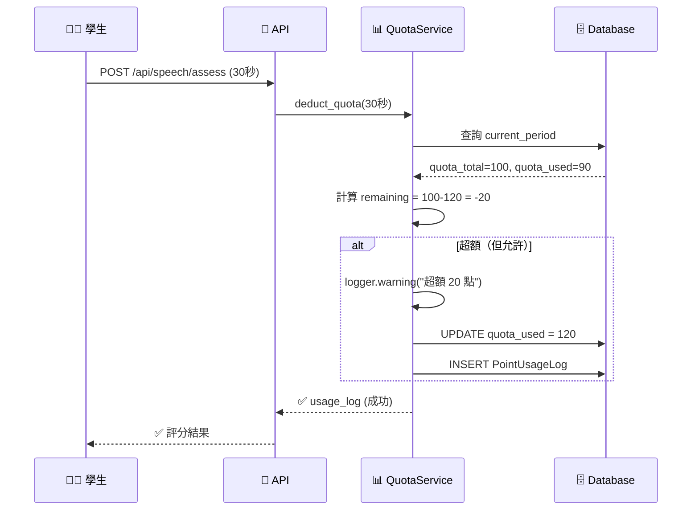
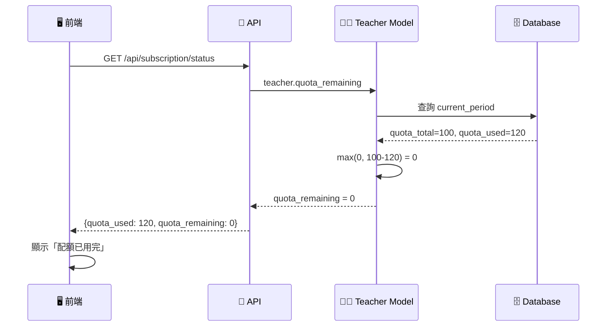

# 配額超額機制詳解 (Quota Exceeded Mechanism)

## 📋 業務需求

**核心原則**：**學生永遠可以學習，配額超限不阻擋**

### 為什麼允許超額？

1. **教育優先**：學生正在學習時，不應因老師配額用完而被中斷
2. **使用者體驗**：避免學生提交作業時突然失敗，造成挫折
3. **商業模式**：記錄超額使用，鼓勵老師升級方案而非強制阻擋

---

## 🔧 技術實作

### 1. 後端扣除邏輯

**檔案**: `backend/services/quota_service.py:150-163`

```python
def deduct_quota(...):
    # 1. 檢查有訂閱（無訂閱則拋出 402）
    current_period = teacher.current_period
    if not current_period:
        raise HTTPException(402, "NO_SUBSCRIPTION")

    # 2. 計算扣除
    points_used = convert_unit_to_seconds(unit_count, unit_type)
    quota_before = current_period.quota_used
    quota_after = quota_before + points_used
    quota_remaining = current_period.quota_total - quota_after

    # 3. 檢查超額（僅記錄 warning，不阻擋）
    if quota_remaining < 0:
        logger.warning(
            f"⚠️ Teacher {teacher.id} quota exceeded: "
            f"{abs(quota_remaining)}s over limit, "
            f"but allowing operation to continue"
        )

    # 4. 扣除配額（即使超額也繼續）
    current_period.quota_used = quota_after  # ⚠️ 允許超過 quota_total

    # 5. 記錄 Log
    usage_log = PointUsageLog(
        points_used=points_used,
        quota_before=quota_before,
        quota_after=quota_after  # 超額也記錄
    )
    db.add(usage_log)
    db.commit()

    return usage_log  # ✅ 成功返回
```

**關鍵點**：
- ❌ **沒有** `if quota_remaining < 0: raise Exception()`
- ✅ **只有** `logger.warning()` 記錄警告
- ✅ **繼續執行** `quota_used = quota_after`

---

### 2. 前端顯示邏輯

**檔案**: `backend/models.py:337-343`

```python
@property
def quota_remaining(self) -> int:
    """當前週期的剩餘配額"""
    period = self.current_period
    if not period:
        return 0

    # 使用 max(0, ...) 確保不會返回負值
    return max(0, period.quota_total - period.quota_used)
```

**範例**：

```python
# 情況 1: 正常使用
quota_total = 10000
quota_used = 5000
quota_remaining = max(0, 10000 - 5000) = 5000  ✅

# 情況 2: 剛好用完
quota_total = 10000
quota_used = 10000
quota_remaining = max(0, 10000 - 10000) = 0  ✅

# 情況 3: 超額使用
quota_total = 10000
quota_used = 10050  # 超額 50 點
quota_remaining = max(0, 10000 - 10050) = max(0, -50) = 0  ✅
```

**為什麼用 `max(0, ...)`？**
- 避免前端顯示「剩餘 -50 點」
- 統一顯示為「已用完（0 點）」
- 更友善的使用者介面

---

### 3. 資料庫實際狀態

```sql
-- SubscriptionPeriod 表結構
CREATE TABLE subscription_periods (
    id SERIAL PRIMARY KEY,
    quota_total INT NOT NULL,
    quota_used INT DEFAULT 0,  -- ⚠️ 沒有 CHECK (quota_used <= quota_total)
    ...
);

-- 超額使用範例
SELECT id, quota_total, quota_used,
       (quota_total - quota_used) as actual_remaining
FROM subscription_periods
WHERE status = 'active';

-- 結果：
-- id | quota_total | quota_used | actual_remaining
-- ---|-------------|------------|------------------
-- 1  | 10000       | 10050      | -50  ⚠️ 超額
```

**設計決策**：
- ✅ 資料庫**不限制** `quota_used <= quota_total`
- ✅ 記錄真實使用量（包括超額部分）
- ✅ 供分析與商業決策使用

---

## 🧪 測試驗證

### 測試場景

**檔案**: `backend/tests/integration/test_complete_quota_flow_e2e.py:test_quota_exceeded_still_allows_usage`

```python
def test_quota_exceeded_still_allows_usage():
    """
    Given: 老師配額 100 點，已使用 90 點（剩餘 10 點）
    When: 學生錄音 30 秒（需要 30 點，超過剩餘 10 點）
    Then:
        - 扣除成功（不拋出異常）
        - quota_used = 120（超過 quota_total）
        - quota_remaining = 0（前端顯示）
        - 實際剩餘 = -20（資料庫記錄）
    """
    # 初始狀態
    period.quota_total = 100
    period.quota_used = 90

    # 嘗試使用 30 點
    usage_log = QuotaService.deduct_quota(
        db, teacher, student_id,
        feature_type="speech_recording",
        unit_count=30, unit_type="秒"
    )

    # 驗證結果
    assert usage_log.points_used == 30  # ✅ 成功扣除
    assert period.quota_used == 120  # ✅ 超過 total
    assert teacher.quota_remaining == 0  # ✅ 前端顯示 0

    # 實際剩餘
    actual_remaining = period.quota_total - period.quota_used
    assert actual_remaining == -20  # ✅ 實際超額 20 點
```

---

### 測試執行結果

```bash
$ pytest tests/integration/test_complete_quota_flow_e2e.py::test_quota_exceeded_still_allows_usage -v -s

======================================================================
🧪 Quota Exceeded Still Allows Usage Test
======================================================================

✅ Initial State:
   Quota Total: 100
   Quota Used: 90
   Quota Remaining: 10

📝 Attempting to use 30 points (exceeds remaining 10)

✅ Deduction Successful (Over Quota Allowed):
   Quota Used: 120 (exceeded by 20)
   Quota Remaining (displayed): 0 (max(0, -20))
   Actual Remaining: -20

======================================================================
🎉 Quota Exceeded Test PASSED
======================================================================
```

---

## 📊 前後端資料流

### 1. 學生提交錄音（超額情況）



---

### 2. 前端查詢配額



---

## 🎯 實際應用場景

### 場景 1: 學生正在錄音

```
時間軸：
10:00 - 老師配額剩餘 5 秒
10:01 - 學生開始錄音（預計 30 秒）
10:01:30 - 學生提交錄音

期望行為：
✅ 學生成功提交
✅ 配額扣除 30 秒（quota_used = total + 25）
✅ 系統記錄 warning
❌ 不應該中斷學生
```

---

### 場景 2: 老師查看配額

```
前端顯示：
配額使用狀況：10025 / 10000 點 (100.25%)
剩餘配額：0 點 ⚠️

建議：
「您的配額已用完，建議升級方案以享有更多配額」

[立即升級] 按鈕
```

---

### 場景 3: 後台分析

```sql
-- 找出超額使用的老師
SELECT
    teacher_id,
    quota_total,
    quota_used,
    (quota_used - quota_total) as over_quota,
    ((quota_used - quota_total) * 100.0 / quota_total) as over_percentage
FROM subscription_periods
WHERE status = 'active' AND quota_used > quota_total
ORDER BY over_quota DESC;

-- 結果：
-- teacher_id | quota_total | quota_used | over_quota | over_percentage
-- -----------|-------------|------------|------------|----------------
-- 123        | 10000       | 10500      | 500        | 5.0%  ⚠️
-- 456        | 10000       | 12000      | 2000       | 20.0%  🔥
```

**商業決策**：
- 超額 5% 以下：發送「配額不足」提醒
- 超額 10% 以上：建議升級方案
- 超額 20% 以上：主動聯繫客戶

---

## ⚠️ 與「訂閱過期」的區別

### 對比表

| 狀態 | 配額超限 | 訂閱過期 |
|------|---------|---------|
| **條件** | `quota_used > quota_total` | `subscription_end_date < now()` |
| **學生可用** | ✅ 可以 | ❌ 不可以 |
| **老師可派作業** | ✅ 可以 | ❌ 不可以 |
| **錯誤碼** | 無（成功） | 402 Payment Required |
| **提示訊息** | Warning log | "訂閱已過期" |

---

### 程式碼對比

```python
# 配額超限（允許）
if quota_remaining < 0:
    logger.warning("超額使用")
    # 繼續執行 ✅

# 訂閱過期（阻擋）
if not teacher.current_period:
    raise HTTPException(402, "NO_SUBSCRIPTION")  # ❌ 拋出異常
```

---

## 📈 監控與告警

### 建議監控指標

```python
# 1. 超額使用率
over_quota_rate = (quota_used - quota_total) / quota_total

# 2. 超額老師數量
SELECT COUNT(*)
FROM subscription_periods
WHERE status='active' AND quota_used > quota_total;

# 3. 平均超額量
SELECT AVG(quota_used - quota_total)
FROM subscription_periods
WHERE status='active' AND quota_used > quota_total;
```

---

### 告警規則

```yaml
Alerts:
  - name: quota_exceeded_warning
    condition: quota_used > quota_total
    severity: warning
    action: 發送 Email 給老師

  - name: quota_exceeded_critical
    condition: quota_used > quota_total * 1.2
    severity: critical
    action: 通知客服主動聯繫
```

---

## 🎓 設計哲學

### 為什麼這樣設計？

1. **教育優先**
   - 學生學習不應被中斷
   - 技術限制不應影響教育品質

2. **商業友善**
   - 記錄超額使用，供分析與升級建議
   - 不強制阻擋，避免使用者反感

3. **技術彈性**
   - 允許短期超額，給老師緩衝時間
   - 透明記錄，方便追蹤與計費

4. **使用者體驗**
   - 避免學生操作失敗
   - 前端顯示友善（0 而非 -20）

---

## 🔄 未來可能的演進

### 階段 1: 當前狀態（無限超額）

```python
# 允許無限超額
if quota_remaining < 0:
    logger.warning("超額使用")
    # 繼續執行
```

---

### 階段 2: 軟限制（超額 + 提醒）

```python
if quota_remaining < 0:
    logger.warning("超額使用")

    # 前端顯示提醒（不阻擋）
    return {
        "success": True,
        "warning": "配額已用完，建議升級方案"
    }
```

---

### 階段 3: 彈性限制（超額上限）

```python
# 允許超額 20%，超過則阻擋
max_allowed = quota_total * 1.2

if quota_after > max_allowed:
    raise HTTPException(402, "配額已嚴重超限，請升級方案")
else:
    # 允許繼續
    logger.warning("超額使用")
```

---

## ✅ 總結

### 核心機制

1. **後端允許超額**：`quota_used` 可以 > `quota_total`
2. **前端顯示 0**：`max(0, total - used)` 避免負值
3. **記錄 warning**：供監控與分析
4. **學生可用**：不阻擋學習體驗

---

### 測試保證

✅ 超額使用不拋出異常
✅ 配額正確記錄（包括超額部分）
✅ Log 完整記錄 (quota_before, quota_after)
✅ 前端顯示友善 (quota_remaining = 0)

---

**設計原則**：**以學生學習為優先，以商業分析為輔助**
