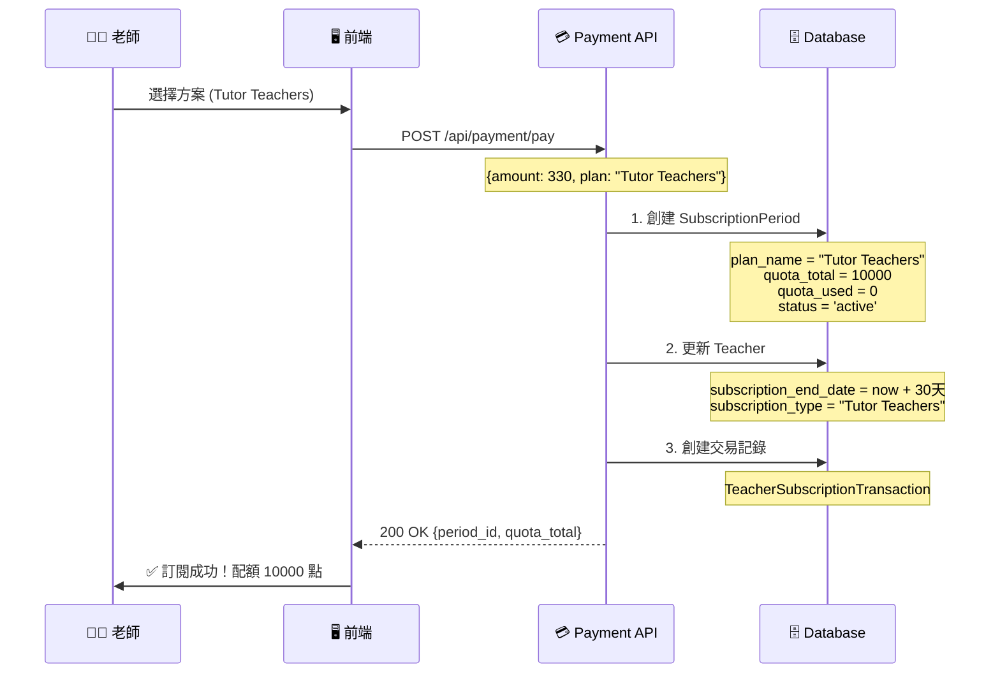
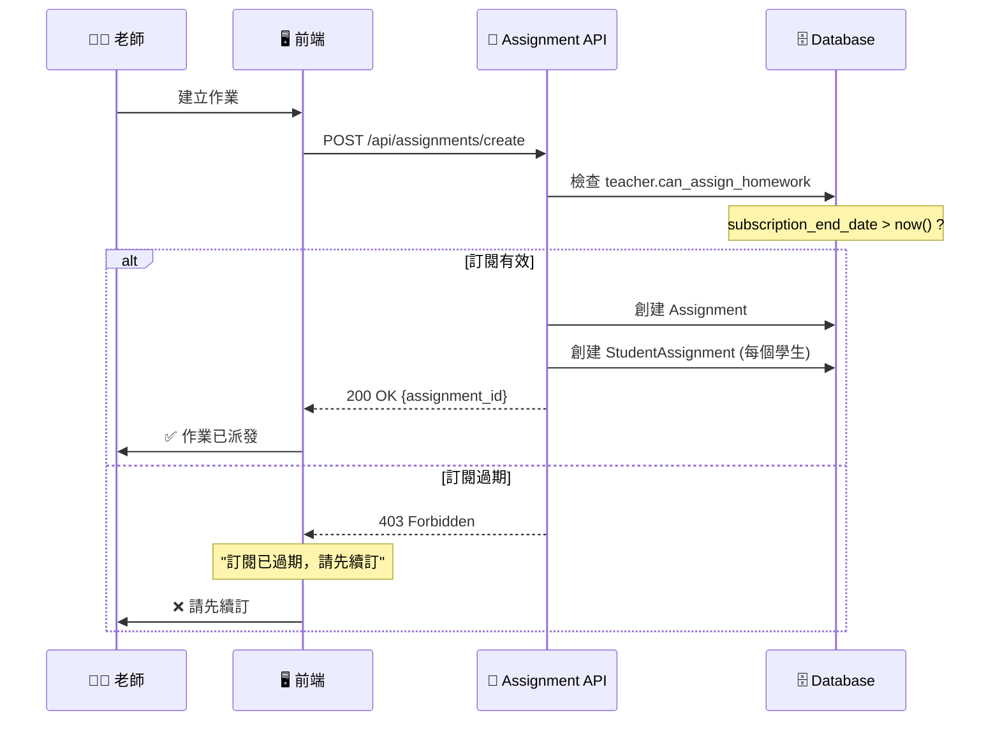
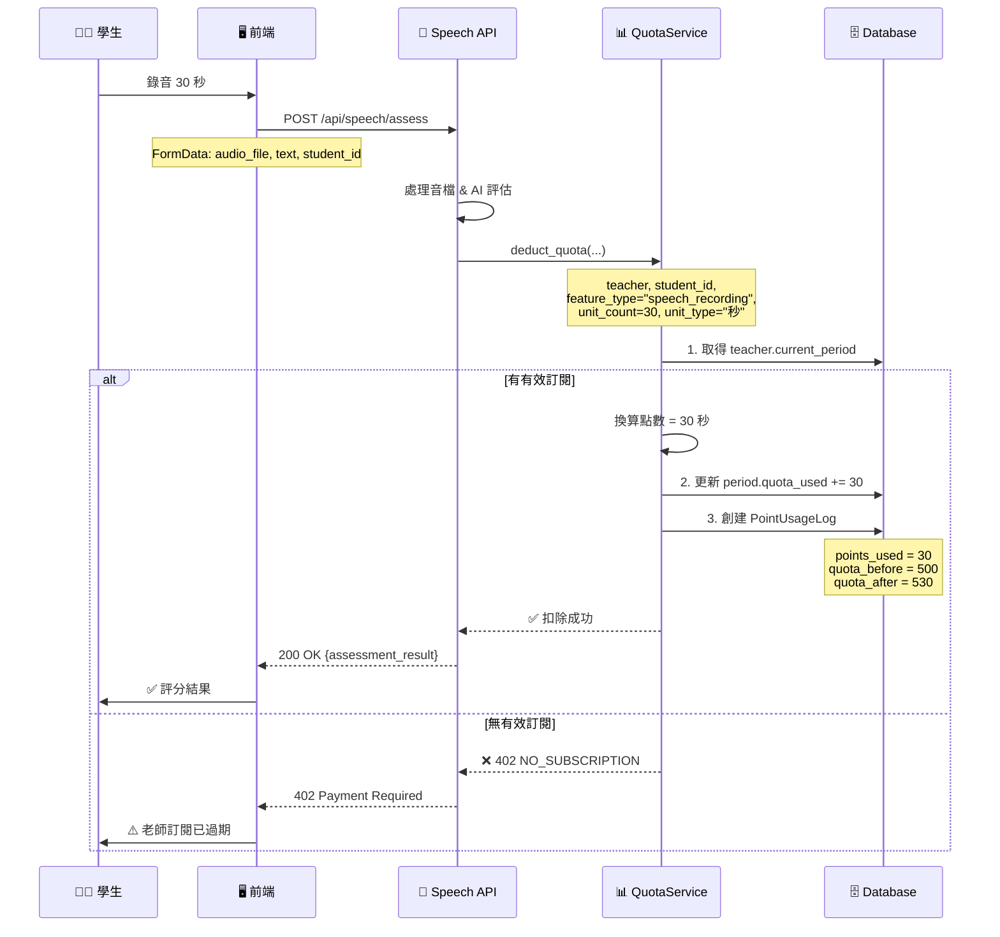

# 配額系統完整流程文檔 (Quota System Flow)

> **文檔版本**: 1.0
> **最後更新**: 2025-01-08
> **測試方法**: TDD (Test-Driven Development)

---

## 📋 目錄

1. [系統架構總覽](#系統架構總覽)
2. [資料庫 Schema](#資料庫-schema)
3. [完整流程圖](#完整流程圖)
4. [API 端點串聯](#api-端點串聯)
5. [前端 UI 整合](#前端-ui-整合)
6. [配額扣除規則](#配額扣除規則)
7. [測試計劃](#測試計劃)
8. [常見問題](#常見問題)

---

## 系統架構總覽

### 核心概念

```yaml
訂閱系統 (Subscription):
  - 控制老師是否能派作業
  - 檢查點: subscription_end_date > now()
  - 屬性: Teacher.can_assign_homework

配額系統 (Quota):
  - 記錄學生使用功能的消耗
  - 單位: 秒數 (seconds)
  - 換算規則:
    - 1 秒錄音 = 1 點
    - 1 字批改 = 0.1 點 (500字 = 50秒)
    - 1 張圖片 = 10 點

週期管理 (Subscription Period):
  - 每次付款創建新週期
  - 配額歸屬週期，不累積
  - 週期過期後配額歸零
```

---

## 資料庫 Schema

### 1. SubscriptionPeriod (訂閱週期)

```python
class SubscriptionPeriod(Base):
    """每次付款創建一個週期，記錄配額總量與使用量"""

    id: int                    # PK
    teacher_id: int            # FK -> teachers.id

    # 訂閱資訊
    plan_name: str             # "Tutor Teachers" / "School Teachers"
    amount_paid: Decimal       # 330 / 660
    quota_total: int           # 10000 / 25000 點（秒）
    quota_used: int            # 已使用點數（秒）

    # 時間範圍
    start_date: datetime       # 週期開始
    end_date: datetime         # 週期結束

    # 狀態
    status: str                # active / expired / cancelled
    payment_method: str        # auto_renew / manual
```

**重要屬性**:
- `quota_total`: 本週期總配額（不可變）
- `quota_used`: 即時更新的使用量
- `status='active'`: 當前有效的唯一週期

---

### 2. PointUsageLog (配額使用記錄)

```python
class PointUsageLog(Base):
    """每次功能使用記錄一筆，追蹤配額消耗明細"""

    id: int
    subscription_period_id: int  # FK -> subscription_periods.id
    teacher_id: int              # FK -> teachers.id
    student_id: int              # FK -> students.id (哪個學生用)
    assignment_id: int           # 哪個作業

    # 功能資訊
    feature_type: str            # "speech_recording" / "speech_assessment" / "text_correction"
    feature_detail: JSON         # {"duration": 30, "file_url": "..."}

    # 點數消耗
    points_used: int             # 本次消耗點數（秒）
    quota_before: int            # 使用前配額
    quota_after: int             # 使用後配額

    # 單位資訊
    unit_count: float            # 單位數量 (30秒, 500字)
    unit_type: str               # "秒" / "字" / "張"

    created_at: datetime
```

**關聯關係**:
```
SubscriptionPeriod (1) ─────< (N) PointUsageLog
Teacher (1) ────────────────< (N) PointUsageLog
Student (1) ────────────────< (N) PointUsageLog
```

---

### 3. Teacher (老師模型)

```python
class Teacher(Base):
    # 舊訂閱欄位（保留向後相容，但不使用）
    subscription_type: str           # 保留
    subscription_end_date: datetime  # 用於 can_assign_homework 檢查

    # 關聯
    subscription_periods: List[SubscriptionPeriod]
    point_usage_logs: List[PointUsageLog]

    # 計算屬性
    @property
    def current_period(self) -> SubscriptionPeriod:
        """取得當前有效的訂閱週期 (status='active')"""
        return session.query(SubscriptionPeriod).filter(
            SubscriptionPeriod.teacher_id == self.id,
            SubscriptionPeriod.status == 'active'
        ).first()

    @property
    def quota_total(self) -> int:
        """當前週期總配額"""
        return self.current_period.quota_total if self.current_period else 0

    @property
    def quota_remaining(self) -> int:
        """當前週期剩餘配額"""
        period = self.current_period
        if not period:
            return 0
        return max(0, period.quota_total - period.quota_used)

    @property
    def can_assign_homework(self) -> bool:
        """是否可派作業 (只檢查訂閱，不檢查配額)"""
        return self.subscription_end_date and self.subscription_end_date > now()
```

---

## 完整流程圖

### 流程 1: 訂閱與配額初始化



**關鍵點**:
1. **每次付款創建新 Period**: 一次付款 = 一個 SubscriptionPeriod
2. **配額歸零**: 新週期的 `quota_used = 0`
3. **只有一個 active**: 前一個 Period 的 `status` 改為 `expired`

---

### 流程 2: 老師派作業 (檢查訂閱)



**⚠️ 重要**:
- **派作業不扣配額**: 只檢查訂閱狀態 (`can_assign_homework`)
- **不檢查配額餘額**: 即使配額用完也能派作業
- **學生永遠可學習**: 即使老師配額超限，學生仍可提交作業

---

### 流程 3: 學生使用功能 (扣除配額)



**扣除邏輯** (`QuotaService.deduct_quota`):

```python
def deduct_quota(
    db: Session,
    teacher: Teacher,
    student_id: int,
    feature_type: str,  # "speech_recording"
    unit_count: float,  # 30
    unit_type: str      # "秒"
):
    # 1. 檢查有效訂閱
    current_period = teacher.current_period
    if not current_period:
        raise HTTPException(402, "NO_SUBSCRIPTION")

    # 2. 換算點數
    points_used = convert_unit_to_seconds(unit_count, unit_type)
    # 30 秒 * 1 = 30 點

    # 3. 即時扣除（不檢查餘額）
    quota_before = current_period.quota_used
    quota_after = quota_before + points_used
    current_period.quota_used = quota_after

    # 4. 記錄 Log
    usage_log = PointUsageLog(
        subscription_period_id=current_period.id,
        teacher_id=teacher.id,
        student_id=student_id,
        feature_type=feature_type,
        points_used=points_used,
        quota_before=quota_before,
        quota_after=quota_after,
        unit_count=unit_count,
        unit_type=unit_type
    )
    db.add(usage_log)
    db.commit()

    # 5. 即使超額也繼續（業務需求）
    if quota_after > current_period.quota_total:
        logger.warning(f"Quota exceeded but allowing")

    return usage_log
```

---

### 流程 4: 配額與 Log 串聯

```
PointUsageLog ───> SubscriptionPeriod.quota_used (同步更新)
      │
      ├─> teacher_id (哪個老師的配額)
      ├─> student_id (哪個學生用的)
      ├─> assignment_id (哪個作業)
      └─> feature_type (用了什麼功能)
```

**彼此關聯**:
- ✅ **緊密串聯**: 每筆 `PointUsageLog` 都會同步更新 `SubscriptionPeriod.quota_used`
- ✅ **即時同步**: 在同一個 transaction 中完成
- ✅ **可追溯**: 透過 Log 可回溯每筆消耗

**查詢範例**:
```python
# 查詢某老師當前週期的所有使用記錄
period = teacher.current_period
logs = db.query(PointUsageLog).filter(
    PointUsageLog.subscription_period_id == period.id
).all()

# 驗證配額正確性
assert period.quota_used == sum(log.points_used for log in logs)
```

---

## API 端點串聯

### 1. 訂閱狀態 API

**端點**: `GET /api/subscription/status`

**回應**:
```json
{
  "status": "subscribed",
  "plan": "Tutor Teachers",
  "end_date": "2025-02-08T00:00:00Z",
  "days_remaining": 30,
  "is_active": true,
  "auto_renew": true,
  "quota_used": 530
}
```

**來源**:
```python
current_period = teacher.current_period
return {
    "quota_used": current_period.quota_used if current_period else 0
}
```

---

### 2. 配額資訊 API

**端點**: `GET /api/quota/info` (假設新增)

**回應**:
```json
{
  "quota_total": 10000,
  "quota_used": 530,
  "quota_remaining": 9470,
  "status": "active",
  "period": {
    "id": 123,
    "start_date": "2025-01-08T00:00:00Z",
    "end_date": "2025-02-08T00:00:00Z"
  }
}
```

**實作**:
```python
@router.get("/quota/info")
def get_quota_info(teacher: Teacher = Depends(get_current_teacher)):
    return QuotaService.get_quota_info(teacher)
```

---

### 3. 使用明細 API

**端點**: `GET /api/quota/usage-logs`

**回應**:
```json
{
  "logs": [
    {
      "id": 1,
      "feature_type": "speech_recording",
      "student_name": "王小明",
      "points_used": 30,
      "unit_count": 30,
      "unit_type": "秒",
      "created_at": "2025-01-08T10:30:00Z"
    }
  ],
  "total_used": 530
}
```

---

## 前端 UI 整合

### 1. 訂閱頁面 (`TeacherSubscription.tsx`)

```typescript
// 獲取訂閱狀態與配額
const fetchSubscriptionData = async () => {
  const subData = await apiClient.get<SubscriptionInfo>(
    "/api/subscription/status"
  );

  console.log("Quota used:", subData.quota_used);
  setSubscription(subData);
};
```

**顯示配額**:
```tsx
<Card>
  <CardTitle>配額使用狀況</CardTitle>
  <Progress
    value={(subscription.quota_used / 10000) * 100}
  />
  <p>{subscription.quota_used} / 10000 點已使用</p>
</Card>
```

---

### 2. 派作業對話框 (`AssignmentDialog.tsx`)

```typescript
interface QuotaInfo {
  quota_total: number;
  quota_used: number;
  quota_remaining: number;
  status: string;
}

// 檢查配額（顯示警告，但不阻擋）
const checkQuota = async () => {
  const quota = await apiClient.get<QuotaInfo>("/api/quota/info");

  if (quota.quota_remaining < 100) {
    toast.warning("配額即將用完，建議儘快升級方案");
  }

  // 不阻擋派作業
  createAssignment();
};
```

---

### 3. 學生作業頁面 (前端無需處理配額)

```typescript
// 學生提交作業時，後端自動扣除配額
const submitRecording = async (audioBlob: Blob) => {
  const formData = new FormData();
  formData.append("audio_file", audioBlob);

  // 後端會自動呼叫 QuotaService.deduct_quota
  const result = await apiClient.post(
    "/api/speech/assess",
    formData
  );

  // 前端不需要處理配額邏輯
};
```

---

## 配額扣除規則

### 單位換算表

| 功能 | 單位類型 | 單位數量 | 換算公式 | 點數 |
|------|---------|---------|---------|------|
| 錄音 | 秒 | 30 | 30 × 1 | 30 |
| 文字批改 | 字 | 500 | 500 × 0.1 | 50 |
| 圖片批改 | 張 | 1 | 1 × 10 | 10 |
| 分鐘錄音 | 分鐘 | 2 | 2 × 60 | 120 |

**實作**:
```python
UNIT_CONVERSION = {
    "秒": 1,
    "字": 0.1,
    "張": 10,
    "分鐘": 60
}

def convert_unit_to_seconds(unit_count: float, unit_type: str) -> int:
    return int(unit_count * UNIT_CONVERSION[unit_type])
```

---

### 功能類型 (Feature Type)

| feature_type | 說明 | 扣除時機 |
|-------------|------|---------|
| `speech_recording` | 語音錄音 | 學生提交錄音時 |
| `speech_assessment` | 語音評估 | AI 評分完成時 |
| `text_correction` | 文字批改 | 老師批改文字時 |

---

## 測試計劃

### 後端測試 (Python + pytest)

#### Test 1: 付款創建週期與配額

**檔案**: `backend/tests/integration/test_quota_subscription_e2e.py`

```python
def test_payment_creates_period_with_quota(db: Session):
    """
    Given: 老師沒有訂閱
    When: 付款購買 Tutor Teachers (330元)
    Then:
        - 創建 SubscriptionPeriod (status=active)
        - quota_total = 10000 秒
        - quota_used = 0 秒
    """
    teacher = create_test_teacher(db)
    assert teacher.current_period is None

    # 模擬付款
    period = SubscriptionPeriod(
        teacher_id=teacher.id,
        plan_name="Tutor Teachers",
        amount_paid=330,
        quota_total=10000,
        quota_used=0,
        start_date=now(),
        end_date=now() + timedelta(days=30),
        status="active"
    )
    db.add(period)
    db.commit()

    # 驗證
    db.refresh(teacher)
    assert teacher.current_period is not None
    assert teacher.quota_total == 10000
    assert teacher.quota_remaining == 10000
```

---

#### Test 2: 派作業檢查訂閱

```python
def test_assign_homework_checks_subscription(db: Session):
    """
    Given: 老師訂閱已過期
    When: 嘗試派作業
    Then: 403 Forbidden "訂閱已過期"
    """
    teacher = create_test_teacher(db)
    teacher.subscription_end_date = now() - timedelta(days=1)
    db.commit()

    response = client.post(
        "/api/assignments/create",
        json={"classroom_id": 1, "title": "Test"},
        headers=get_auth_headers(teacher)
    )

    assert response.status_code == 403
    assert "subscription has expired" in response.json()["detail"]
```

---

#### Test 3: 學生使用扣除配額

```python
def test_student_usage_deducts_quota(db: Session):
    """
    Given: 老師有 10000 點配額
    When: 學生錄音 30 秒
    Then:
        - period.quota_used = 30
        - 創建 PointUsageLog (points_used=30)
        - quota_remaining = 9970
    """
    teacher, period = setup_teacher_with_subscription(db, quota=10000)
    student = create_test_student(db)

    # 模擬學生錄音
    QuotaService.deduct_quota(
        db=db,
        teacher=teacher,
        student_id=student.id,
        feature_type="speech_recording",
        unit_count=30,
        unit_type="秒"
    )

    # 驗證
    db.refresh(period)
    assert period.quota_used == 30
    assert teacher.quota_remaining == 9970

    # 驗證 Log
    log = db.query(PointUsageLog).filter_by(
        subscription_period_id=period.id
    ).first()
    assert log.points_used == 30
    assert log.quota_before == 0
    assert log.quota_after == 30
```

---

#### Test 4: 配額超限仍允許使用

```python
def test_quota_exceeded_still_allows_usage(db: Session):
    """
    Given: 老師配額剩餘 10 點
    When: 學生錄音 30 秒（超過 20 點）
    Then:
        - 仍然扣除成功
        - quota_used = 40（允許負值）
        - 記錄 warning log
    """
    teacher, period = setup_teacher_with_subscription(db, quota=10000)
    period.quota_used = 9990  # 只剩 10 點
    db.commit()

    # 嘗試使用 30 點
    result = QuotaService.deduct_quota(
        db=db,
        teacher=teacher,
        student_id=1,
        feature_type="speech_recording",
        unit_count=30,
        unit_type="秒"
    )

    # 驗證：應該成功
    assert result.points_used == 30
    db.refresh(period)
    assert period.quota_used == 10020  # 超額使用
    assert teacher.quota_remaining == -20  # 允許負值
```

---

#### Test 5: Log 與 Period 同步

```python
def test_logs_sync_with_period(db: Session):
    """
    Given: 老師有多筆使用記錄
    When: 計算 Log 總和
    Then: sum(logs.points_used) == period.quota_used
    """
    teacher, period = setup_teacher_with_subscription(db)

    # 模擬多筆使用
    for i in range(10):
        QuotaService.deduct_quota(
            db=db,
            teacher=teacher,
            student_id=i,
            feature_type="speech_recording",
            unit_count=30,
            unit_type="秒"
        )

    # 驗證同步
    logs = db.query(PointUsageLog).filter_by(
        subscription_period_id=period.id
    ).all()

    total_used = sum(log.points_used for log in logs)
    db.refresh(period)
    assert period.quota_used == total_used
    assert total_used == 300  # 10 * 30
```

---

### 前端測試 (TypeScript + Playwright)

#### Test 1: 訂閱頁顯示配額

**檔案**: `frontend/tests/e2e/teacher-subscription.spec.ts`

```typescript
test('should display quota usage correctly', async ({ page }) => {
  // Given: 老師有訂閱且已使用 530 點
  await loginAsTeacher(page, 'demo@duotopia.com');

  // When: 進入訂閱頁
  await page.goto('/teacher/subscription');

  // Then: 顯示正確配額
  await expect(page.locator('[data-testid="quota-used"]')).toContainText('530');
  await expect(page.locator('[data-testid="quota-total"]')).toContainText('10000');
  await expect(page.locator('[data-testid="quota-remaining"]')).toContainText('9470');
});
```

---

#### Test 2: 配額不足時顯示警告

```typescript
test('should warn when quota is low', async ({ page }) => {
  // Given: 配額剩餘 < 100 點
  await mockQuotaAPI(page, { remaining: 50 });

  // When: 開啟派作業對話框
  await page.click('[data-testid="create-assignment-btn"]');

  // Then: 顯示警告
  await expect(page.locator('.toast-warning')).toContainText('配額即將用完');

  // 但仍可派作業
  await expect(page.locator('[data-testid="confirm-btn"]')).toBeEnabled();
});
```

---

### 測試執行指令

```bash
# 後端測試
npm run test:api:integration     # 整合測試
npm run test:api:e2e             # E2E 測試
npm run test:api:all             # 所有測試

# 前端測試
npm run test:e2e                 # Playwright E2E

# 完整測試
npm run test:all
```

---

## 常見問題

### Q1: 派作業會扣配額嗎？

**A**: ❌ 不會。派作業只檢查 `teacher.can_assign_homework`（訂閱狀態），不扣配額。

---

### Q2: 配額用完學生還能做作業嗎？

**A**: ✅ 可以。配額超限不阻擋學生學習（業務需求），但會記錄 warning log。

---

### Q3: 配額會跨週期累積嗎？

**A**: ❌ 不會。每個 `SubscriptionPeriod` 的配額獨立，過期後歸零。

---

### Q4: 如何查詢配額使用明細？

**A**: 查詢 `PointUsageLog` 表，可按學生、作業、功能類型分組統計。

```python
# 某學生的使用量
student_usage = db.query(func.sum(PointUsageLog.points_used)).filter(
    PointUsageLog.student_id == student_id,
    PointUsageLog.subscription_period_id == period.id
).scalar()
```

---

### Q5: 訂閱過期後配額會怎樣？

**A**:
1. `SubscriptionPeriod.status` 變為 `expired`
2. `teacher.current_period` 返回 `None`
3. 無法再扣配額（會拋出 402 錯誤）
4. 舊配額記錄永久保存在 `PointUsageLog`

---

## 總結

### 系統設計原則

✅ **訂閱控制派作業**: 老師需有效訂閱才能派作業
✅ **配額記錄使用**: 學生使用功能時扣除老師配額
✅ **學生永遠可學**: 配額超限不阻擋學生學習
✅ **完整追蹤記錄**: 每筆消耗都有 Log 可追溯
✅ **週期獨立管理**: 配額不累積，每個週期歸零

### 關鍵檢查點

| 檢查點 | 位置 | 規則 |
|-------|------|------|
| 派作業 | `/api/assignments/create` | `teacher.can_assign_homework` |
| 扣配額 | `QuotaService.deduct_quota` | `teacher.current_period` 存在 |
| 顯示配額 | 前端 UI | `subscription.quota_used` |

---

**文檔維護**: 本文檔應隨系統更新同步維護，確保測試覆蓋所有流程。
