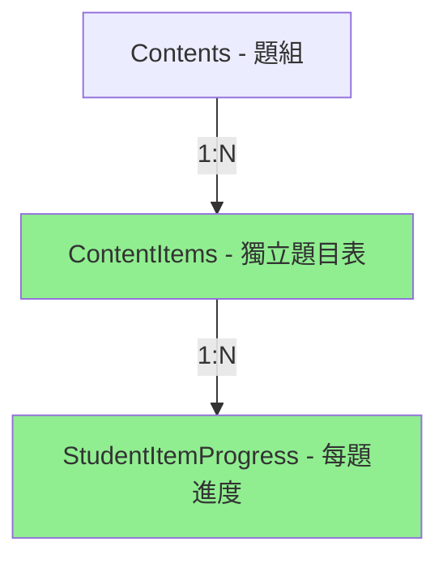

# 作業系統資料庫重新設計方案

## 🎯 設計目標
1. 消除陣列索引同步問題
2. 每個題目（Item）獨立追蹤
3. 支援題目版本控制
4. 提高資料完整性

## 📊 新資料庫結構設計

### 方案一：Item 獨立成表（推薦）⭐



#### 新增資料表

```sql
-- 1. 將 Items 從 JSONB 改為獨立表格
CREATE TABLE content_items (
    id SERIAL PRIMARY KEY,
    content_id INTEGER NOT NULL REFERENCES contents(id) ON DELETE CASCADE,
    order_index INTEGER NOT NULL,
    text TEXT NOT NULL,
    translation TEXT,
    audio_url TEXT,  -- 範例音檔
    metadata JSONB,  -- 其他彈性資料
    created_at TIMESTAMP DEFAULT NOW(),
    updated_at TIMESTAMP DEFAULT NOW(),
    UNIQUE(content_id, order_index)
);

-- 2. 學生每題的進度（取代現有的陣列結構）
CREATE TABLE student_item_progress (
    id SERIAL PRIMARY KEY,
    student_assignment_id INTEGER NOT NULL REFERENCES student_assignments(id) ON DELETE CASCADE,
    content_item_id INTEGER NOT NULL REFERENCES content_items(id),

    -- 答題資料
    recording_url TEXT,
    answer_text TEXT,
    submitted_at TIMESTAMP,

    -- AI 評分（扁平化，不用 JSONB）
    accuracy_score DECIMAL(5,2),
    fluency_score DECIMAL(5,2),
    pronunciation_score DECIMAL(5,2),
    ai_feedback TEXT,
    ai_assessed_at TIMESTAMP,

    -- 狀態
    status VARCHAR(20) DEFAULT 'NOT_STARTED',
    attempts INTEGER DEFAULT 0,

    created_at TIMESTAMP DEFAULT NOW(),
    updated_at TIMESTAMP DEFAULT NOW(),

    UNIQUE(student_assignment_id, content_item_id)
);

-- 3. 保留 StudentContentProgress 作為摘要表
ALTER TABLE student_content_progress
ADD COLUMN completion_rate DECIMAL(5,2),  -- 完成率
ADD COLUMN average_score DECIMAL(5,2);    -- 平均分數
-- response_data 可以廢棄或僅作為快取
```

#### 資料流程範例

```python
# 創建題目
content = Content(title="Be Verbs Practice")
db.add(content)

# 創建個別題目
items = [
    ContentItem(content_id=content.id, order_index=0, text="I am a student"),
    ContentItem(content_id=content.id, order_index=1, text="You are happy"),
    ContentItem(content_id=content.id, order_index=2, text="He is tall"),
]
db.add_all(items)

# 學生答題 - 每題獨立記錄
progress = StudentItemProgress(
    student_assignment_id=365,
    content_item_id=items[1].id,  # 直接關聯到特定題目
    recording_url="audio123.webm",
    accuracy_score=85.5
)
db.add(progress)
```

### 方案二：使用複合主鍵（中度改動）

保留現有結構，但改善 response_data：

```sql
-- 新增獨立的答題記錄表
CREATE TABLE student_responses (
    student_assignment_id INTEGER NOT NULL,
    content_id INTEGER NOT NULL,
    item_index INTEGER NOT NULL,  -- 題目索引

    recording_url TEXT,
    answer_text TEXT,

    -- AI 評分
    ai_assessment JSONB,

    created_at TIMESTAMP DEFAULT NOW(),
    updated_at TIMESTAMP DEFAULT NOW(),

    PRIMARY KEY (student_assignment_id, content_id, item_index),
    FOREIGN KEY (student_assignment_id, content_id)
        REFERENCES student_content_progress(student_assignment_id, content_id)
);
```

### 方案三：Event Sourcing（長期最佳）🚀

```sql
-- 事件表：記錄所有操作
CREATE TABLE learning_events (
    id SERIAL PRIMARY KEY,
    event_type VARCHAR(50) NOT NULL,  -- 'RECORDING_UPLOADED', 'AI_ASSESSED', etc
    student_id INTEGER NOT NULL,
    assignment_id INTEGER NOT NULL,
    content_id INTEGER NOT NULL,
    item_index INTEGER,

    -- 事件資料
    event_data JSONB NOT NULL,

    -- 不可變
    created_at TIMESTAMP DEFAULT NOW()
);

-- 範例事件
INSERT INTO learning_events (event_type, student_id, assignment_id, content_id, item_index, event_data)
VALUES
('RECORDING_UPLOADED', 1, 365, 23, 1,
 '{"recording_url": "audio123.webm", "duration": 15}'),

('AI_ASSESSED', 1, 365, 23, 1,
 '{"accuracy": 85.5, "fluency": 78.9, "pronunciation": 90.2}');

-- 建立 Materialized View 來查詢當前狀態
CREATE MATERIALIZED VIEW student_progress_current AS
SELECT
    student_id,
    assignment_id,
    content_id,
    item_index,
    (SELECT event_data->>'recording_url'
     FROM learning_events e2
     WHERE e2.student_id = e.student_id
     AND e2.content_id = e.content_id
     AND e2.item_index = e.item_index
     AND e2.event_type = 'RECORDING_UPLOADED'
     ORDER BY created_at DESC LIMIT 1) as latest_recording,
    -- ... 其他欄位
FROM learning_events e
GROUP BY student_id, assignment_id, content_id, item_index;
```

## 📈 方案比較

| 方案 | 優點 | 缺點 | 實施難度 | 建議 |
|-----|------|------|---------|------|
| **方案一：Item 獨立表** | • 資料正規化<br>• 查詢簡單<br>• 易於維護 | • 需要大改動<br>• 資料遷移複雜 | 🔴 高 | ⭐ 長期最佳 |
| **方案二：複合主鍵** | • 改動較小<br>• 保留現有邏輯 | • 仍有同步問題<br>• 查詢較複雜 | 🟡 中 | 短期過渡 |
| **方案三：Event Sourcing** | • 完整歷史<br>• 易於除錯<br>• 可回溯 | • 概念複雜<br>• 需要新技能 | 🔴 高 | 未來理想 |

## 🛠️ 實施建議

### 第一階段：快速修復（1週）
```python
# 在 API 層加入驗證
def validate_response_data(response_data, item_count):
    recordings = response_data.get('recordings', [])
    answers = response_data.get('answers', [])
    ai_assessments = response_data.get('ai_assessments', [])

    # 確保長度一致
    if len(recordings) != item_count:
        recordings.extend([None] * (item_count - len(recordings)))

    return {
        'recordings': recordings[:item_count],
        'answers': answers[:item_count],
        'ai_assessments': ai_assessments[:item_count]
    }
```

### 第二階段：資料結構改善（1月）
```python
# 改用字典結構而非陣列
response_data = {
    "items": {
        "0": {
            "recording": "audio1.webm",
            "answer": "I am a student",
            "ai_score": {"accuracy": 85.5}
        },
        "1": {
            "recording": None,
            "answer": None,
            "ai_score": None
        }
    }
}
```

### 第三階段：資料庫重構（3月）
1. 創建新表格結構
2. 寫資料遷移腳本
3. 平行運行新舊系統
4. 逐步切換
5. 廢棄舊表格

## 💡 立即可做的改善

### 1. 加入資料庫約束
```sql
-- 確保 response_data 格式正確
ALTER TABLE student_content_progress
ADD CONSTRAINT check_response_data_format
CHECK (
    jsonb_typeof(response_data->'recordings') = 'array' AND
    jsonb_typeof(response_data->'answers') = 'array' AND
    jsonb_typeof(response_data->'ai_assessments') = 'array'
);
```

### 2. 創建輔助函數
```sql
-- 安全更新特定 item 的錄音
CREATE OR REPLACE FUNCTION update_item_recording(
    p_progress_id INTEGER,
    p_item_index INTEGER,
    p_recording_url TEXT
) RETURNS VOID AS $$
BEGIN
    UPDATE student_content_progress
    SET response_data = jsonb_set(
        COALESCE(response_data, '{}'::jsonb),
        ARRAY['recordings', p_item_index::text],
        to_jsonb(p_recording_url)
    )
    WHERE id = p_progress_id;
END;
$$ LANGUAGE plpgsql;
```

### 3. 加入觸發器確保一致性
```sql
CREATE OR REPLACE FUNCTION ensure_array_consistency()
RETURNS TRIGGER AS $$
DECLARE
    item_count INTEGER;
BEGIN
    -- 獲取 content 的 item 數量
    SELECT jsonb_array_length(c.items)
    INTO item_count
    FROM contents c
    WHERE c.id = NEW.content_id;

    -- 確保所有陣列長度一致
    NEW.response_data = jsonb_build_object(
        'recordings',
        CASE
            WHEN jsonb_array_length(NEW.response_data->'recordings') < item_count
            THEN NEW.response_data->'recordings' || jsonb_build_array()
            ELSE NEW.response_data->'recordings'
        END,
        'answers',
        -- 類似處理...
    );

    RETURN NEW;
END;
$$ LANGUAGE plpgsql;

CREATE TRIGGER ensure_consistency
BEFORE INSERT OR UPDATE ON student_content_progress
FOR EACH ROW EXECUTE FUNCTION ensure_array_consistency();
```

## 📊 結論

**短期建議**：使用方案二（複合主鍵）+ 資料驗證
**長期建議**：逐步遷移到方案一（Item 獨立表）

這樣可以：
1. 立即解決陣列同步問題
2. 保持系統運行
3. 逐步改善架構
