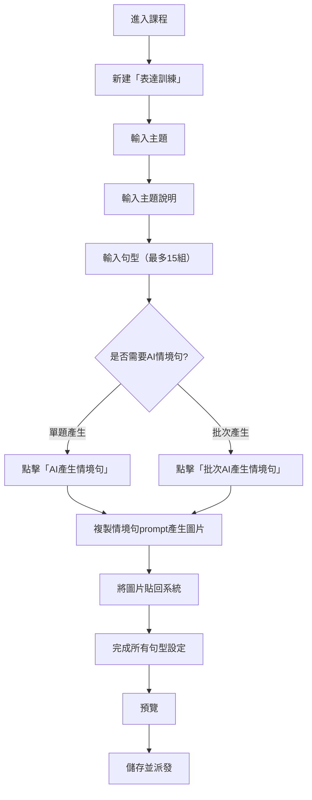

# 表達訓練（output-training）模組討論紀錄

## 命名與定位

- 中文名稱：表達訓練
- 英文資料夾：output-training
- 目標：支援老師指派「主題」與「單句」練習，學生可用口說或寫作方式作答，AI 給予回饋與訂正建議。

## 功能需求摘要

1. 老師可自由輸入主題與句型，指派給學生。
2. 學生可選擇口說或寫作作答。
3. AI 針對學生回答（口說/寫作）給予錯誤回饋與修正建議，學生訂正後再回答，完成一題。
4. 支援「主題訓練」與「單句訓練」兩種模式，皆在同一模組內，派發與統計可分開。
5. 單句練習需有標準答案情境，AI 可協助老師自動產生。
6. 主題對話練習以達成率與錯誤次數為評分依據。

## 討論重點紀錄

---

## 老師操作流程圖（示意）

# 老師建檔主題＋單句練習資料新建畫面（Markdown 示意圖）

## 老師操作流程

1. 在課程當中新建「表達訓練」活動。
2. 輸入主題。
3. 輸入主題說明。
4. 依序輸入句型（最多 10 組）：

- 句型組 1：可單題點擊「AI 產生情境句」產生英文情境句及母語翻譯（母語依用戶預設）。
- 句型組 2、句型組 3...依序輸入。

5. 可點擊「批次 AI 產生情境句」，一次為所有句型產生英文情境句及母語翻譯。
6. 完成後點擊「儲存」。

## 1. 主題設定

- 主題名稱：[__________________________]
- 主題說明（選填）：
  [__________________________________________________________]

---

## 2. 句型設定

| 句型範本         | AI 自動產生情境句 | 標準答案（可編輯）      | 操作   |
| ---------------- | ----------------- | ----------------------- | ------ |
| There is (some)  | 有一個鞦韆在樹下  | [有一個鞦韆在樹下]      | [刪除] |
| There are (some) | 有一些烏龜在池塘  | [有一些烏龜在池塘裡...] | [刪除] |
| What's there?    | 公園裡有什麼？    | [公園裡有一棵樹...]     | [刪除] |
| ...              | ...               | ...                     | [刪除] |

- [新增句型]（可手動輸入句型與標準答案）

> **說明：AI 產生的情境句主要用於「單句練習」作業。每個句型都會有一個對應的情境句，老師可複製情境句的 prompt，使用熟悉的 AI 圖片生成工具產生圖片，再貼回系統，讓學生在單句練習時有圖片輔助。主題對話練習則不強制搭配情境句與圖片。**

---

## 3. 派發設定

- 練習類型：
  - [ ] 單句練習
  - [ ] 主題對話練習
- 指派對象：[班級/學生選擇器]
- 截止日期：[______/______/______]

---

## 4. 預覽與儲存

- [預覽學生端畫面]
- [儲存並派發]
